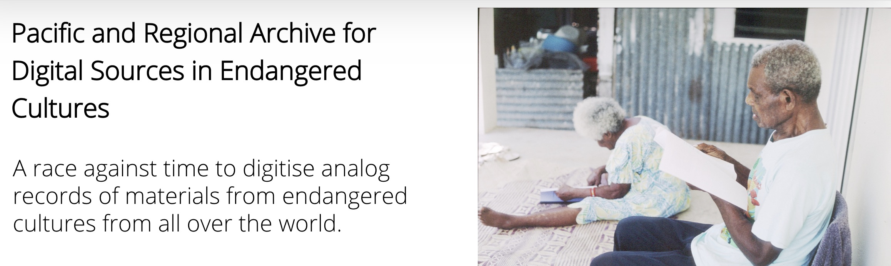
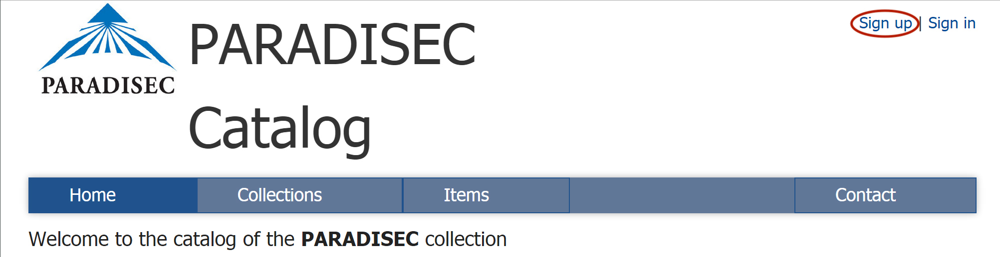

  

    Table of contents
  

  {: .text-delta }
1. TOC
{:toc}

# Getting Started with PARADISEC

  

Last updated: 28 September 2022

## How to become a PARADISEC user
In order to view items in the PARADISEC archive, you need to first ***sign up*** and become a PARADISEC user. 

  

The process of signing up is simple; however, you do need to have an email address.  Go to the PARASDISEC catalog web page: [http://catalog.paradisec.org.au/](http://catalog.paradisec.org.au/){:target="_blank"}, and click on **Sign up** in the upper right‐hand corner. Once you sign up, you get an automated message informing you to check your email to confirm your account, 

>
>*"A message with a confirmation link has been sent to your email address. Please open the link to activate your account"*
>

Click on the link in your email to confirm. 

Congratulations, you are now a PARADISEC user! 

  As a registered user you can access data in collections having <b>OPEN ACCESS</b> once you sign in. Each new open-access collection you visit, you will need to agree to PARADISEC’s conditions of access.

  If the collection has <b>CLOSED ACCESS</b>, you may send a request to access data that has restrictions on viewing by following instructions provided by the collector on their catalog page.

*Read more about PARADISEC's Conditions of Access [here](https://www.paradisec.org.au/deposit/access-conditions/){:target="_blank"}*.

## How to become a PARADISEC depositor

### STEP 1: Sign up to become a PARADISEC user and explore the archive

Follow the above instructions and become a PARADISEC user. Once you have done so, it is recommended that you browse the collections held in PARADISEC so that you can observe the different ways they can be organised. Here are some examples of different collections:

* ***PhD thesis:*** [OE1](https://dx.doi.org/10.4225/72/58949afab6af0){:target="_blank"} is a collection of narratives and wordlists that the depositor used in writing their PhD thesis. This includes segmented audio files that are linked to the exemplar utterances within the thesis.
* ***Field methods course:*** The [MEU1](https://dx.doi.org/10.26278/5e00d67b8be35){:target="_blank"} collection holds all recordings generated during a Linguistics field methods course. Note how the different type of events (classroom recordings vs breakout sessions) are kept together by the nature of the item names.
* ***Separate collections for each language/dialect/variety:*** Explore two of this depositor's 27 collections, [SDM42](https://catalog.paradisec.org.au/collections/SDM42){:target="_blank"} and [SDM45](http://catalog.paradisec.org.au/collections/SDM45){:target="_blank"}. Each of these collections feature one language variety. There is no limit as to how many collections you can create.
* ***Many languages in one collection:*** In the [DD1](https://dx.doi.org/10.4225/72/56E8248563EE0){:target="_blank"} collection, the depositor has included recordings of over 25 languages within the one collection. This collection is still growing! 

### STEP 2: Contact PARADISEC
Once you are ready for us to create a collection, contact the PARADISEC admin team at [admin@paradisec.org.au](mail.to:admin@paradisec.org.au){:target="_blank"} or the [CoEDL Data Manager](mailto:julia.miller@anu.edu.au){:target="_blank"}, because only PARADISEC administrators can create a collection in the catalog.

#### Preliminary exploration of your files

Before you contact PARADISEC, take a look at your files and determine how you want your material organised. Do you need one collection? Or more than one? Make note of the different file formats you have.

#### Information to provide to PARADISEC

Once you have decided which files you would like to archive, come up with a name and description for your collection. As for the Collection ID, PARADISEC administrators can help you come up with this- the collection ID should be a unique identifier (could be your initials in all caps and a digit, or the ISO language code).

*Example collection IDs:* ***JM1, JCM4, OE1, MEU1, etc.***  

Summary of information needed when you are ready to contact PARADISEC:

* A brief title of your collection
* A more detailed description of your collection
* Funding body (if applicable) (e.g. ARC, ELDP, etc.) and grant identifier (if applicable) (e.g. CoEDL = CE140100041 or Wellsprings = FL130100111)

### STEP 3: Organise materials to be sent to collection

#### PARADISEC's metadata spreadsheet

*This section only outlines the spreadsheet option for metadata capture. To learn more about LaMeta metadata tool, please visit the [Metadata & Data Management](https://paradisec-archive.github.io/PARADISEC_workflows/03_data_management.html){:target="_blank"} page.*

PARADISEC has a simple spreadsheet that allows us to automatically create the catalog entries for items in your collection. You can acces the spreadsheet [here](http://www.paradisec.org.au/wp-content/uploads/2020/10/PDSCMinimalMetadata2020.xlsx){:target="_blank"}. *(If the .xlsx file does not download automatically, then right-click on the link to save the file).* Please do not alter the structure of the spreadsheet, as this will prevent the auto-upload process for us.

Once your collection has been created and has been populated with the metadata for your items, you can edit you collection by adding further information directly via the catalog pages. You can add details such as:

* your institutional affiliation
* a more precise map (you can manually drag a rectangular selection to get a more precise location
* you can change access conditions to individual items
* you can assign editor privileges to a colleague or research assistant who may be helping you enrich the collection's metadata

#### PARADISEC's file naming conventions

Getting your *archival* file names in order should come *after* you have created your collection and *after* you have settled on the organisation of your items within your collection, because the collection and item IDs make up part of your file names.

**ANATOMY OF A PARADISEC FILE NAME** 
Our system requires all files to adhere to specific file-naming conventions. This section will step you through the required parts of the filenames.

**TEMPLATE:** [CollectionID] - [ItemID] - [ContentFile] . file extension

| Coll ID  |  Item ID  | Content  |  Extension  |
|  :----:  |   :----:   | :----:  | :----:  |
| JCM01 | 20150908_wordlist | 01 | .wav |

>
>**NOTE:** No spaces or special characters are allowed in your file names, and only the two hyphens seen above are allowed. Underscores are fine. File names should not exceed 30 characters, excluding file extensions.
>

1. **CollectionID** is your PARADISEC collection ID and it typically has the shape of your initials in capital letters and a number. This ID can be determined by you, but must be confirmed as available for use by a PARADISEC administrator. This ID is created when you set up a collection in PARADISEC.

2. **ItemID** An item could be recordings from a cassette tape, or now in the born-digital age, it is typically a recording event containing all related files from that session, including audio, video, images, transcriptions, etc. You must use a terse Item ID here; Item IDs *must* be under 30 characters. You may use an underscore ( _ ) if you need a separator; hyphens ( ‐ ) are prohibited *within* your Item ID as they are PARADISEC operators. You could have speaker initials in your Item ID (ABC), name of the task (wordlist), field site (NT); however, all of that can be put into metadata fields, rather than in your file names. You could simply name your items 001, 002, 003, etc.

3. **ContentFile** is the final necessary part to a file name. This part of the name allows you to enumerate files of the same format, i.e. photos with 001, 002, etc, or multiple tracks of a single audio or video session, 01, 02, 03, etc. You could distinguish the type of microphone used for an audio track in this part of the file name, e.g. LM (lapel mic) or HM (for head mounted mic).

>
>**NOTE:** Even if your item contains only one file, and thus does not need to be differentiated from other files within the same item, you still need to have this third part of the file name. You could use -00, -01, -wordlist01, -original, etc.
>

### STEP 4: Fill out a PARADISEC deposit form for each collection you are creating

You will need to fill out a [deposit form](http://www.paradisec.org.au/PDSCdeposit.pdf){:target="_blank"} that provides PARADISEC with your contact information, access conditions for your collection, including any restrictions. *(If the .xlsx file does not download automatically, then right-click on the link to save the file).* Fill in the form, sign it, scan or photograph it, and email it back to us. We keep this digital record with your collection.

### STEP 5: Send your files to PARADISEC

If you are planing to archive digital files with PARADISEC, and your institution is part of the Australian Access Federation (AAF), you can sign up for a [Cloudstor](https://cloudstor.aarnet.edu.au/){:target="_blank"} account. Once you do, you get 1TB of free storage available to you instantly. You can also send us OneDrive, Dropbox, Google Drive links. These options are the best means to transfer files to PARADISEC. If you do not use any of those cloud storage options, but would like to transfer your files this way, contact [PARADISEC](mailto:admin@paradisec.au.org){:target="_blank"} or the [CoEDL Data Manager](mailto:julia.miller@anu.edu.au){:target="_blank"} and we can create a Cloudstor folder for you to use for transferring files to us.

You can also use Dropbox, Google Drive or OneDrive.

If uploading files to a cloud service is not possible due to a lack of computer access or poor internet connections, you can post a hard drive of your materials to PARADISEC at:

***PARADISEC  
Room 3019, Sydney Conservatorium of Music C41  
The University of Sydney  
NSW 2006 AUSTRALIA***  

Or to the CoEDL Data Manager at:

***ATTN: CoEDL Data Manager  
The ARC Centre of Excellence for the Dynamics of Language  
College of Asia Pacific  
The Australian National University  
Coombs Building, 9 Fellows Road  
Acton 2601 ACT AUSTRALIA***  

⬆️ [Back to top](#)