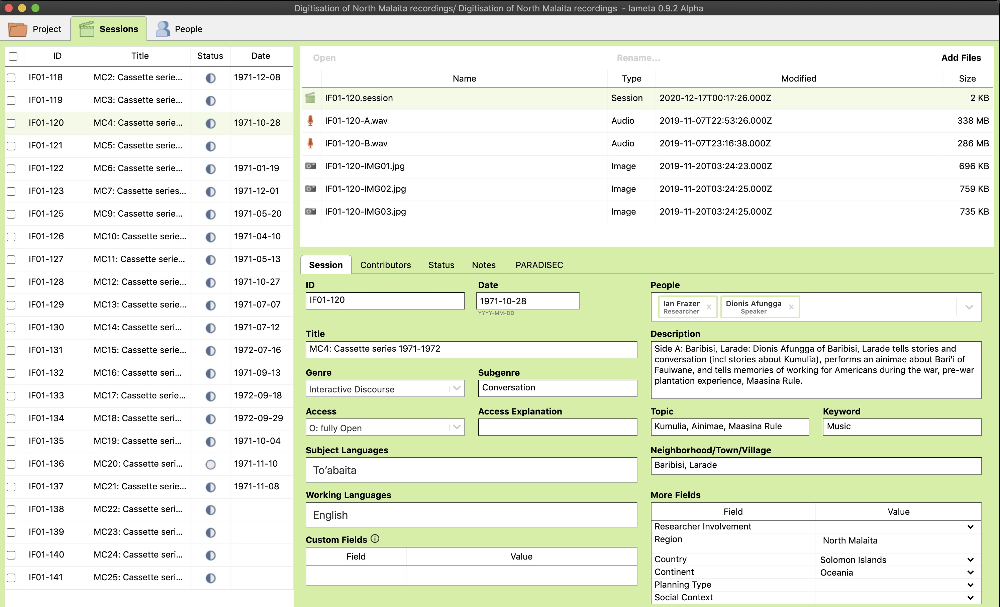

  

    Table of contents
  

  {: .text-delta }
1. TOC
{:toc}

# Metadata & Data Management
 

  

Last updated: 02 October 2022

Much of the information on this page is geared toward preparing your collection for archiving with [PARADISEC](https://www.paradisec.org.au/){:target="_blank"} (Pacific and Regional Archive for Digital Sources in Engangered Cultures); some of the organisational concepts can be applied to depositing with other archives such as [ELAR](https://elar.soas.ac.uk/){:target="_blank"} (The Endangered Language Archive), or even if you haven't yet set a plan for archiving.

## Data management

### Data management in the field
Whilst in the field, you should be mindful of having good metadata for your recording sessions. This can be done in the following ways:
* Most important: speak your metadata at the beginning of every audio and video recording, on every track, so that if there is ever an organisational catastrophe, you will be able to retreive the important metadata by reviewing the recordings. This should minimally include the date, the event or elicitation task, your name and those of your participants, and location of the recording.
* You can create a directory structure that has date and event information in the folder names so that when you drag your files from an SD card into a folder, you will know immediately what files are associated with which event. this is a good option if you have limited power and time on the laptop must be short. If you plan to set the file names in the Zoom recorder, this can be time consuming and fleeting, as this has to be done with every battery change.
* You can create a text file or word doc that lists each recording and all the same metadata that you speak in the recording. You can add other helpful information such as places where there is an important point in the recording, or where there is a disruption, etc.
* You can write this information in your field notebook as you are recording and taking notes.
* Keep a running spreadsheet of all your recordings, events, and speakers. You can refer to this often over the course of your project.
* You can, and probably should do all of the above, as redundancy in metadata documentation is **never** a bad thing.

### Data Management Plan (DMP)
A data management plan (DMP) is a brief explanation (up to 2 pages) outlining how you are going to store, manage, share and preserve your data during and after your project. 

Writing a DMP will help you reflect upon what type of data you will be collecting, how much space you will require to house your data as you work with it, what sort of collaborative platforms you may require for your research, and your long-term plans for preserving and disseminating the data.

It is becoming more frequent that funding institutions require that you submit a DMP along with your application. You may also need a letter of suport from your chosen repository. Should you choose PARADISEC as your archive, we can review your DMP, offer feedback, and provide you with a letter of support if we agree that your plan and materials are a good fit for our archive.

**ARDC** (Australian Research Data Commons) offers Australian institutional data management resources [here](https://projects.ands.org.au/policy.php){:target="_blank"} and international resources [here](https://ardc.edu.au/resources/working-with-data/datamanagement/data-management-plans/){:target="_blank"}.

### File naming
Here are some ***general suggestions*** for naming your files:
* do not use spaces or any special characters, other than hyphens (-) or underscores (_)
* for the date use the form **YYYYMMDD**
* file name should not be longer than 25 characters

For ***PARADISEC*** we have specific file naming rules: 

[CollectionID] - [ItemID] - [ContentFile] . file extension

| Coll ID  |  Item ID  | Content  |  Extension  |
|  :----:  |   :----:   | :----:  | :----:  |
| JCM01 | 20150908_wordlist | 01 | .wav |

For more about PARADISEC's file naming conventions, click [here](https://paradisec-archive.github.io/PARADISEC_workflows/02_getting-started.html#paradisecs-file-naming-conventions){:target="_blank"}

>
>**NOTE**: You may need to change your file names when you archive your recordings in order to adhere to the requirements of the archive. You will be able to associate metadata to the recordings within the archives. It is OK that not all metadata is contained in your filenames.
>
 

## Metadata management tools

At this time there are two metadata tools that we are supporting. Follow the links below to get the most recent versions of each.

### PARADISEC-configured Spreadsheet
 
 Right-click on this [link](http://www.paradisec.org.au/wp-content/uploads/2020/10/PDSCMinimalMetadata2020.xlsx){:target="_blank"} to save the PARADISEC pre-configured spreadsheet. All fields necessary to create catalog items in PARADISEC are included.
> Note:  Rows in the PARADISEC spreadsheet are meant to capture metadata at the level of an item, or recording session. Do not list individual file information.

  

### LaMeta
This free software will allow you to create metadata files using a simple graphical interface. Follow this [link](https://github.com/onset/laMETA/releases){:target="_blank"} to download the latest version. If you need guidance using LaMeta, take a look at this helpful [blog from ELAR](https://elararchive.org/blog/2020/04/30/introducing-lameta/){:target="_blank"}.

The LaMeta metadata export lends itself for archiving with [ELAR](https://elar.soas.ac.uk/){:target="_blank"}, creating .imdi metadata files (XML); however, there is an option to export the project metadata as a CSV that is formatted for PARADISEC. This function is in the early stages and your export may require some cleaning up.

  

 

## Additional Resources

Hatton, John, Gary Holton, Mandana Seyfeddinipur, Nick Thieberger. 2021. Lameta [software] [https://github.com/onset/laMETA/releases](https://github.com/onset/laMETA/releases){:target="_blank"}

Thieberger, N. and Berez, A. (2011). Linguistic Data Management. In N. Thieberger (Ed.), *The Oxford Handbook of Linguistic Fieldwork*. Oxford University Press. [https://doi.org/10.1093/oxfordhb/9780199571888.013.0005](https://doi.org/10.1093/oxfordhb/9780199571888.013.0005){:target="_blank"}

⬆️ [Back to top](#)