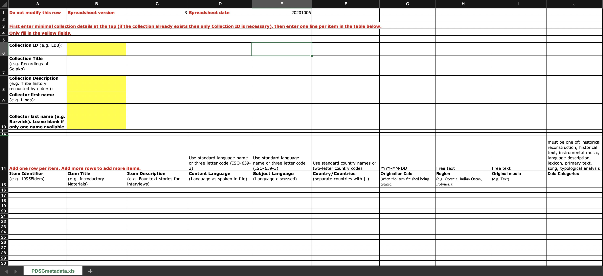

  

    Table of contents
  

  {: .text-delta }
1. TOC
{:toc}

## Metadata & Data Management

🚧 This page is currently under construction 🚧

  

Last updated: 8 July 2021

Much of this information is geared toward preparing your collection for archiving with [PARADISEC](https://www.paradisec.org.au/){:target="_blank"} (Pacific and Regional Archive for Digital Sources in Engangered Cultures), but some of the organisational concepts can be applied to depositing with other archives such as [ELAR](https://elar.soas.ac.uk/){:target="_blank"} (The Endangered Language Archive).

### Data management

#### Data Management Plan (DMP)
A data management plan (DMP) is a brief explanation (up to 2 pages) outlining how you are going to store, manage, share and preserve your data during and after your project. 

Writing a DMP will help you reflect upon what type of data you will be collecting, how much space you will require to house your data as you work with it, what sort of collaborative platforms you may require for your research, and your long-term plans for preserving and disseminating the data.

It is becoming more frequent that funding institutions require that you submit a DMP along with your application. You may also need a letter of suport from your chosen repository. Should you choose PARADISEC as your archive, we can review your DMP, offer feedback, and provide you with a letter of support if we agree that your plan and materials are a good fit for our archive.

**ARDC (Australian Research Data Commons)** offers Australian institutional data management resources [here](https://projects.ands.org.au/policy.php){:target="_blank"} and international resources [here](https://ardc.edu.au/resources/working-with-data/datamanagement/data-management-plans/){:target="_blank"}.

#### File naming

#### File & directory organisation

#### Preparing for archiving 

### Metadata management tools

At this time there are two metadata tools that we are supporting. Follow the links below to get the most recent versions of each.

#### PARADISEC-configured Spreadsheet
 
 Right-click on this [link](http://www.paradisec.org.au/wp-content/uploads/2020/10/PDSCMinimalMetadata2020.xlsx){:target="_blank"} to save the PARADISEC pre-configured spreadsheet. All fields necessary to create catalog items in PARADISEC are included.
> Note:  Rows in the PARADISEC spreadsheet are meant to capture metadata at the level of an item, or recording session. Do not list individual file information.

  

#### LaMeta
This free software will allow you to create metadata files via a simple graphical interface. Follow this [link](https://github.com/onset/laMETA/releases){:target="_blank"} to download the latest version. If you need guidance using LaMeta, take a look at this helpful [blog from ELAR](https://elararchive.org/blog/2020/04/30/introducing-lameta/){:target="_blank"}.

The LaMeta metadata export lends itself for archiving with [ELAR](https://elar.soas.ac.uk/){:target="_blank"}, creating .imdi metadata files (XML); however, there is an option to export the project metadata as a CSV that is formatted for PARADISEC. This function is in the early stages and your export may require some cleaning up.

  

 

### Additional Resources

Hatton, John, Gary Holton, Mandana Seyfeddinipur, Nick Thieberger. 2021. Lameta [software] https://github.com/onset/laMETA/releases

Thieberger, N. and Berez, A. (2011). Linguistic Data Management. In N. Thieberger (Ed.), *The Oxford Handbook of Linguistic Fieldwork*. Oxford University Press. https://doi.org/10.1093/oxfordhb/9780199571888.013.0005

[Back to top](#)