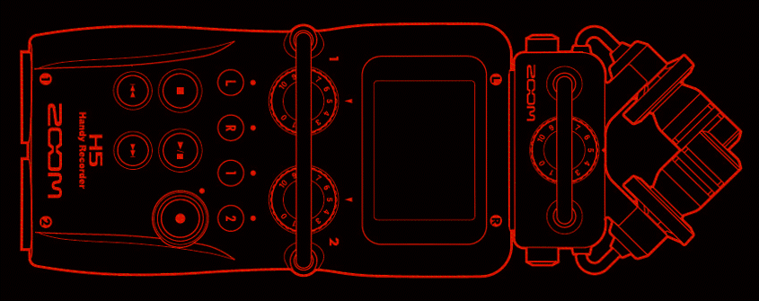

  

    Table of contents
  

  {: .text-delta }
1. TOC
{:toc}

## Standard formats for data collection and archiving

🚧 This page is currently under construction 🚧

  

Last updated: 16 September 2021

### Standard formats for archiving with PARADISEC
The tables below contain the file formats we can accept from depositors and the final formats that go into the archive

 

| Media  |  Media formats PARADISEC will accept1   | 
| :---   | :---                                        | 
| Audio  |  .wav, .aiff, .m4a .mp32 *(96khz, 24bit is our archival target; however 48khz, 24bit, or as close to the archival as possible will be accepted)* |
| Video  |  .mts (AVCHD), .avi, .mov, .m4v, .dv, .mpg2 |
| Images | .tif, .jpg, .png, .CR2                      |
| Text   | .txt, .xml, .html, .pdf, .rtf *(.doc/.docx should be converted to .rtf/.pdf, .xls/.xlsx to .csv prior to submission)*                                        |
| Annotations | .eaf, .cha, .xml, .txt, .srt, .trs, .TextGrid|
| Lexicons |  .xml, .txt , .fwbackup *(containing no media files)*|

 

| Media  |  Final formats PARADISEC creates and archives| 
| :---   | :---                                       | 
| Audio  |  *Archival copy:* .wav (96kHz, 26bit)    |
|        |  *Access copy:* .mp3 
| Video  |  *Archival copy:* .mxf (lossless JPEG2000)|
|        |  *Access copy:* .mp4 (H.264)             |
| Images |  *Archival copy:* .tif (400dpi)          |
|        |  *Access copy:* .jpg                     |
| Text   |  *Archival and access copies:* Same as original *(see accepted formats above)*|
| Annotations | *Archival and access copies:* Same as original *(see accepted formats above)*|
| Lexicons | *Archival and access copies:* Same as original *(see accepted formats above)*|

1*If you have a format other than those listed above, please contact us so we can advise you on what can be done.*

2*If you have files such as .mp3 (audio) or .mpg (video), we will certainly accept them; however, if you are collecting new recordings, please avoid these formats, as they are lossy, compressed formats. Look at the following section for capture suggestions*

### Suggestions for audio recorders and video cameras
#### Audio recordings

#### Video recordings

[Back to top](#)
