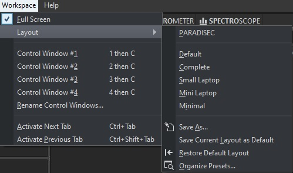
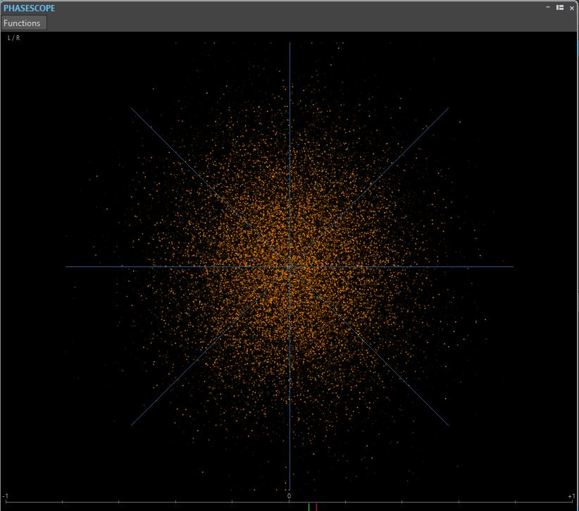
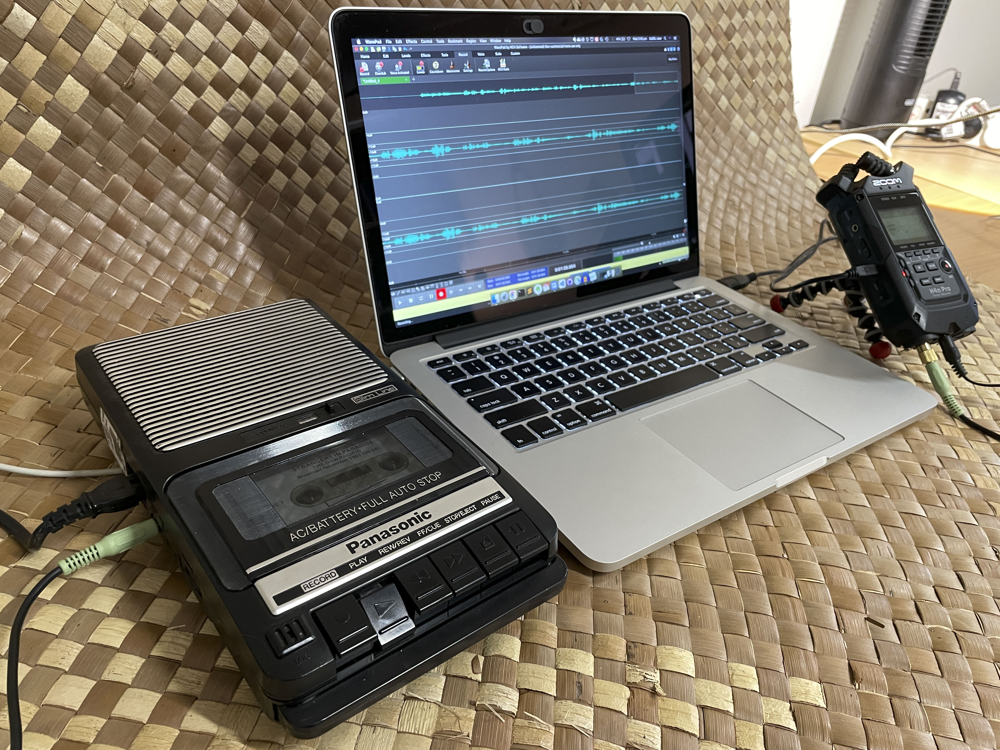

---
title: Audio Digitising
layout: default
published: true
nav_order: 6
--- 

  

    Table of contents
  

  {: .text-delta }
1. TOC
{:toc}

# Audio Digitising of Analogue Tapes

  

Last updated: 02 October 2022

This page outlines the technical workflow for digitising cassette and reel-to-reel tapes for the PARADISEC. This workflow can be modified to accommodate other organisations in their specific digitising goals.

## Current configuration of the equipment

### Computer workstation

The ANU PARADISEC studio utilises a high-performance DELL OptiPlex 7080 Tower PC workstation with the following specifications:

| SPECIFICATION | DETAILS     |
| :-------------| : --------- |
|***Memory*** | 32GB (4x8GB) |
|***Processor*** | Intel Core i7-10700 (8-core, 16MB cache, 2.9GHz to 4.8GHz, 65W) |
|***Drive*** | M.2 512GB Class 35 Solid State Drive |
|***Drive*** | 2.5in 1TB 7200 Hard Disk Drive |
|***Drive*** | 8xDVD +/-RW 9.5mm Optical Disk Drive |
|***Full-size Tower*** | SSF (Small Form Factor) will not accomodate necessary soundcard |

### Soundcard: [RME HDSPe AIO Pro](https://www.rme-audio.de/hdspe-aio-pro.html){:target="_blank"}

  

A soundcard needed to be added to the DELL tower to provide us with the necessary input and output connections and meet the high-level specifications set by our industry's peak-body: [IASA](https://www.iasa-web.org/about-iasa){:target="_blank"} (the International Association of Sound and Audiovisual Archives). 
 >* D-sub 9-pin socket (for the Digital Breakout Cable: AES/EBU & SPDIF)
 >* up to 192kHz/24-bit, balanced stereo in/output
 >* a high quality digital audio stream synchronisation mechanism
 >* allow the transfer of a digital audio data stream having undergone no change or alteration

### AD/DA Converter: [RME ADI-2 PRO FS R Black Edition](https://www.rme-audio.de/adi-2-pro-fs-be.html){:target="_blank"}

  

Having an external, stand-alone analogue/digital converter is critical so that the following archival specifications can be met (see IASA link below for the precise parameters for each):

 > * Total Harmonic Distortion + Noise
 > * Dynamic Range (Signal to Noise)
 > * Frequency Response
 > * Intermodulation Distortion
 > * Amplitude Linearaity
 > * Spurious Aharmonic Signals
 > * International Clock Accuracy
 > * Jitter
 > * External Synchronisation

**READ MORE ABOUT** analogue to digital converters and sound cards in [sections 2.4 and 2.5](https://www.iasa-web.org/tc04/key-digital-principles){:target="_blank"} of **IASA**'s *TC04: Guidelines on the Production and Preservation of Digital Audio Objects*. 

### Audio cassette player: [Tascam 122 mk III](https://tascam.com/downloads/tascam/324/122mkIII_TECHDOC.pdf){:target="_blank"}

  

**READ MORE ABOUT** the use of cassette tape machines in [section 5.4.5](https://www.iasa-web.org/tc04/replay-equipment-professional-cassette-machines){:target="_blank"} of **IASA**'s *TC04: Guidelines on the Production and Preservation of Digital Audio Objects*.

### Reel-to-reel tape player: [Revox C270](https://cloudstor.aarnet.edu.au/plus/s/0KI2utmHztYAsDA){:target="_blank"}

  

### Reel-to-reel tape player: [Studer A807](https://cloudstor.aarnet.edu.au/plus/s/zSVf4KCzr2e0evR){:target="_blank"}

  

**READ MORE ABOUT** the use of reel-to-reel machines in [section 5.4.4](https://www.iasa-web.org/tc04/replay-equipment-professional-reel-machines){:target="_blank"} of IASA's TC04: Guidelines on the Production and Preservation of Digital Audio Objects.

## Software
The software we use to digitise audio is [Steinberg's Wavelab 10 Pro](https://new.steinberg.net/wavelab/){:target="_blank"}

## Digitising Cassette Tapes

> 
>**Note:** Avoid internet browsing and any activity over the network during digitisation *(these activities can cause interference, which may result in digital clips and unwanted errors in the signal)*. Avoid using mobile phones or other mobile devices (better yet, turn them off or leave them outside of the studio), including close wi-fi transmitters, and as a precaution, close any programs other than WaveLab during the digitising process.
>

1.	Turn on computer and login with your ANU UDS credentials
   
      Resources you should find on the desktop:
      * Wavelab Pro 10.0 shortcut
      * Wavelab Pro 10.0 [operations manual](https://steinberg.help/wavelab-manuals/wavelab-pro/wavelab-pro-10/){:target="_blank"}    

2.  Turn on the RME ADI-2 PRO FS R  
3.	Turn on and load a tape into the Tascam 122 mk III  
4.	Open the Wavelab program.

     You may need to select **New Project** if presented with a start-up window. 

     

       
     

     Otherwise, the main Wavelab window will open up

     

       
     

     Make sure the Workspace layout is the PARADISEC layout. Go to the banner menu at the top and select Workspace > Layout > PARADISEC

     

       
     

5.	Once main window opens, go up to the banner menu again and select File > New.

     

       
     

6.	Another window pops up asking you to select the template. Select PARADISEC.

     

       
     

7.	A new timeline will appear in the AUDIOEDITOR window located in the lower half of the main window. In this window, select the ANALYZE tab along the top. Make sure to tick the radio button next to **Audio Input**
  
     

       
     

     From the meter tabs in the upper right quadrant of the main window, grab the PHASESCOPE and drag it out to create a popped-out, larger window.

8.	Look to the buttons on the bottom of the window
  
     

       
     

     Press the button with the dot on it, far right. This will open the following recording window and activate the PHASESCOPE:
  
     

       
     

9.	In *Method tab* under *File to Create*, select **Named file** from the drop down menu, then type in the file name you want to assign this file. Select the target location, E:\DigitisedFiles for the output files.

10.	Play the tape as a means to test the levels audio levels to recording. These can be seen in the Recording window. Play for a minute or so, making sure the signal stays **below -12.00 dB**. 
  
     

       
     

11.	If the signal on the tape is too loud, you should adjust this on the TASCAM using the OUTPUT dial on the far right of the tape machine. The dial should be on 8 to begin with. Make adjustments from there.
  
     

       
     

12.	Once you adjust the volume, press the Reset button underneath the audio levels back in Wavelab so that you can confirm you have adjusted the audio adequately.
  
     

       
     

13.	As you are previewing the tape, you can see that the PHASESCOPE is also actively monitoring the audio. We will use this scope to help guide us in our **Azimuth adjustment**. 
    
14.	You can find the Azimuth screw on the TASCAM machine in the gap right above the STOP button. It is the screw to the left of the heads. Use the supplied tiny screwdriver.
  
     

       
     

     

     **READ MORE ABOUT** Azimuth adjustments in [section 5.4.12](https://www.iasa-web.org/tc04/corrections-errors-misaligned-recording-equipment){:target="_blank"} of **IASA**'s *TC04: Guidelines on the Production and Preservation of Digital Audio Objects*.
     

15.	Confirm the PHASESCOPE is active. There will be a gently moving cluster of random noise *(see image below)*. 
  
     

       
     

     Play the tape. Once the signal is clearly coming through, turn the screw to the left and to the right, using your ears and the phasescope to help you determine the clearest signal. If the tape is a cassette tape the same signal will be on both channels. Aim to get the line as vertically straight as possible *(see image below)*.  

     

       
     

   
16.	Once you get the cleanest, most vertical line you can, rewind the tape, press ***Record*** in Wavelab, then press play on the TASCAM and begin digitising the tape. Remain nearby to monitor the progress of this task; keep in mind that something could go wrong as the tape is being played. If you remain nearby you can stop the machine if the tape breaks, preventing further damage to the tape. 

## Digitising Reel-to-reel Tapes

1. Put the tape reel onto the left spindle, the right is reserved for the take-up empty reel. Make sure tape is spooling off to the left of the reel. Once on the spindle, lift top of the spindle and turn it so that the tabs can lock down the reel.

    

       
     

2. Bring down the tape leader (the extra bit of non-magnetic tape at the beginning of the reel, usually green) and thread it through the various rollers as below. 

    

       
     

3. Once threaded through, if digitising on the Studer, flip up the head shield. The shield flips up automatically when play is engaged on the the ReVox.

4. Move the reels manually along until the point where the tape leader ends and
the magnetic tape begins almost reach the tape heads.

5. Reset the counter so that it reads 00.00.00.

6. Follow the same WaveLab instructions as above for testing the volumes of the output. To adjust the output volume, make sure the UNCAL light is on. This means the audio volume is uncalibrated and you can adjust volume as needed using the CH1 and CH2 REP/SYNC LEVEL

7. Check the speed of the playback. If it sounds too slow or too fast, cycle through the choices of 3.75, 7.5 or 15. If these do not appear to create the right speed, make note and we may need to adjust once audio is digitised.

8. Adjust the azimuth for open reel tapes. The hex nut is located directly above the tape head as seen in image below:

    

       
     

     If the tape you are digitising is recorded as mono, and there is signal only in one channel, you will see the line is at a 45° angle, leaning toward the left or the right, depending upon which track the mono signal was recorded on (*see image below*).  

     

       
     

     Many tapes we receive were recorded as mono, with a different mono track on each side of the tape. We digitise these two tracks simultaneously. As a result, there will be an X shape for representing both mono tracks. As the audio for both tracks is playing simultaneously (one track will play normally, the other will be reversed), you will rely more on the phasescope to adjust the azimuth *(see image below)*.  

     

       
     

9. Once everything has been checked and adjusted, stop the reel from playing.

10. Get WaveLab set up to record the track, following the instructions as outlined above (specifically: step 16).

      >
      **NOTE:** As previously mentioned, it may be that the tape has been recorded as mono tracks on both sides. Our system will digitise both mono tracks simultaneously. If you are using headphones, you will hear one track in one ear, playing correctly, and the second track in the other ear, playing backwards.
      >

11. When the tape is coming to the end, watch closely and stop playback when the magnetic tape finishes passing along the heads and the trailer tape appears (usually red). Then stop the recording in WaveLab.

12. Press z-loc to rewind the tape back onto original reel.

     >
      **NOTE:** DO NOT HIT REWIND. Use the Z-Loc button. This will rewind the tape, slowing down as it approaches the 00.00.00 point in the counter. This will ensure we do not need to rethread the tape, and it is a more cautious way to treat the tape
     >

## Low-cost Options
The equipment and software mentioned above have been selected to adhere to best practice in digital preservation and archiving as set out by IASA. However, it is very a costly set-up. Below are some options for audio cassette digitising that recognise the need for standards, but also recognise that preservation (and access to the tape content) is paramount.

### Software
Steinberg Wavelab is a very powerful studio software for audio capture and editing. However there are a couple of free options that are available for both audio recording and editing that are also easy to use: 

* [NCH Wavepad](https://www.nch.com.au/wavepad/index.html)

    

       
     

* [Ocenaudio](https://www.ocenaudio.com/en/startpage)

    

       
     

Both of these options allow you to capture a stereo audio file at 96kHz/24bit and do post-production on the files you have created, cutting off long silences at the beginning or end of the files, boosting the audio gain if volume is too low, etc.

### Equipment

#### Alternative to the AD/DA Converter
As a stand-in for the digital converter mentioned above, you can use an audio recorder. Zoom recording devices are great tools to use in data collection, and if you already have one, you can also use it for digitising.  

| Audio recorder | Features             |
| :---              | :---              |
| Zoom H4N Pro   [Link](https://zoomcorp.com/en/jp/handy-recorders/handheld-recorders/h4n-pro/){:target="_blank"}       | 44.1/48/96kHz, 16/24bit WAV; internal X/Y stereo mic, 2 XLR external mic inputs *(with phantom power)*, 3.5mm mic input, powered by 2 AA batteries or USB, records to SD/SDHC cards |

To be able to digitise a tape, you need to find a playback device. These are increasingly becoming harder to source. I managed to locate a Panasonic shoe-box style tape player and a Marantz field recorder to trial a digitising set-up.

Both of these devices have output jacks for headphones. The Panasonic output is 3.5mm and is configured for mono output only. If you are using a tape player that has a mono headphone jack, ***you will not capture the stereo content of the cassette***. There are various ways you can **simulate** a stereo signal, including copying the content of the one channel into a second channel. This is NOT true stereo and will sound a bit flat as compared to the original stereo signal.

Another option is to do as above- copy the contents of one channel into a second channel, then select one of these channels and add an off-set of 25-40ms to it. Esentially, you are shifting one channel to play slightly later than the other channel. You perceive a richer signal then when the two identical channels are synchronised. This phenomenon os called the Has effect. To read more about the **Haas effect** follow the links [here](http://www.benvesco.com/blog/mixing/2008/turn-a-mono-track-into-rich-stereo/){:target="_blank"} and [here](https://en.wikipedia.org/wiki/Precedence_effect){:target="_blank"}. Again, this is NOT true stereo.

>
>**Note:** These interventions are ***NOT*** archival practice. However, if you are wanting to make available tapes to language communities, this can add a richness that you would not be able to get if your equipment did not have a stereo output.
>

  

       
     

 

## Additional Resources
Blewer, A. (2020). **Pragmatic Audiovisual Preservation**, DPC Technology Watch Report, p. 45. Digital Preservation Coalition. [https://doi.org/10.7207/twr20-10](https://doi.org/10.7207/twr20-10){:target="_blank"}.

Bradley, K. (ed.). (2009). **IASA-TC04: Guidelines on the production and preservation on digital audio objects: Standards, recommended practices and strategies**, 2nd edition (IASA Technical Publications IASA-TC04; Technical Committee Standards, Recommended Practices, and Strategies, p. 156).  International Association of Sound and Audiovisual. [https://www.iasa-web.org/tc04/audio-preservation](https://www.iasa-web.org/tc04/audio-preservation){:target="_blank"}

Casey, M., & Gordon, B. (2007). **Sound Directions: Best Practices for Audio Preservation**. Sound Directions. [http://www.dlib.indiana.edu/projects/sounddirections/papersPresent/index.shtml](http://www.dlib.indiana.edu/projects/sounddirections/papersPresent/index.shtml){:target="_blank"}.

⬆️ [Back to top](#)

 This work is licensed under a <a rel="license" href="http://creativecommons.org/licenses/by-nc-sa/4.0/">Creative Commons Attribution-NonCommercial-ShareAlike 4.0 International License</a>{:target="_blank"}.