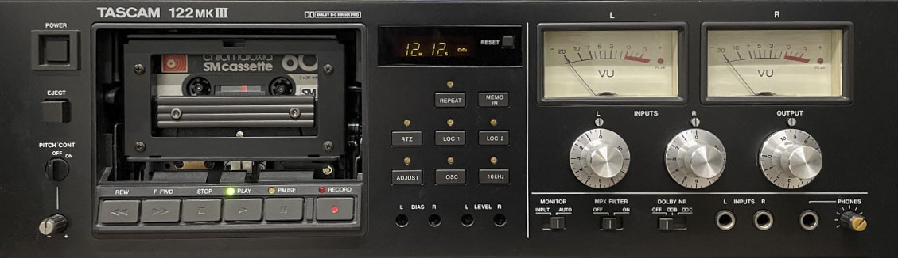
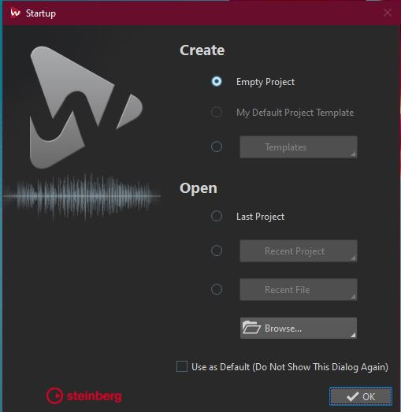
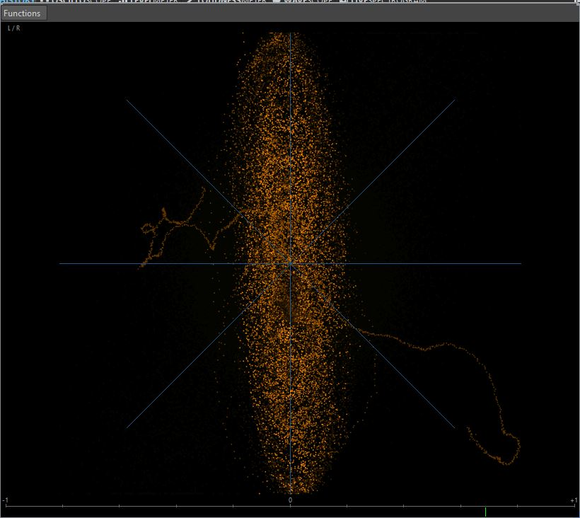

---
title: Audio Digitising
layout: default
published: true
nav_order: 6
--- 

  

    Table of contents
  

  {: .text-delta }
1. TOC
{:toc}

# Audio Digitising of Analogue Tapes

           🚧 This page is currently under construction 🚧        

  

Last updated: 22 October 2021

This page outlines the technical workflow for audio digitising for the PARADISEC unit based at the Australian National University. This workflow can be modified to accommodate other organisations in their specific digitising goals.

### About the equipment

#### Computer workstation

The ANU PARADISEC studio utilises a high-performance DELL OptiPlex 7080 Tower PC workstation with the following specifications:

| SPECIFICATION | DETAILS     |
| :-------------| : --------- |
|***Memory*** | 32GB (4x8GB) |
|***Processor*** | Intel Core i7-10700 (8-core, 16MB cache, 2.9GHz to 4.8GHz, 65W) |
|***Drive*** | M.2 512GB Class 35 Solid State Drive |
|***Drive*** | 2.5in 1TB 7200 Hard Disk Drive |
|***Drive*** | 8xDVD +/-RW 9.5mm Optical Disk Drive |
|***Full-size Tower*** | SSF (Small Form Factor) will not accomodate necessary soundcard |

#### Soundcard: [RME HDSPe AIO Pro](https://www.rme-audio.de/hdspe-aio-pro.html){:target="_blank"}

  

A new soundcard needed to be added to the DELL tower to provide us with the necessary input and output connections and meet the high-level specifications set by our industry's peak-body: [IASA](https://www.iasa-web.org/about-iasa){:target="_blank"} (the International Association of Sound and Audiovisual Archives). 
 >* D-sub 9-pin socket (for the Digital Breakout Cable: AES/EBU & SPDIF)
 >* up to 192kHz/24-bit, balanced stereo in/output
 >* a high quality digital audio stream synchronisation mechanism
 >* allow the transfer of a digital audio data stream having undergone no change or alteration

#### AD/DA Converter: [RME ADI-2 PRO FS](https://www.rme-audio.de/adi-2-pro-fs.html){:target="_blank"}

  

Having an external, stand-alone analogue/digital converter is critical so that the following specifications can be met (see IASA link below for the precise parameters for each):

 > * Total Harmonic Distortion + Noise
 > * Dynamic Range (Signal to Noise)
 > * Frequency Response
 > * Intermodulation Distortion
 > * Amplitude Linearaity
 > * Spurious Aharmonic Signals
 > * International Clock Accuracy
 > * Jitter
 > * External Synchronisation

**READ MORE ABOUT** analogue to digital converters and sound cards in [sections 2.4 and 2.5](https://www.iasa-web.org/tc04/key-digital-principles){:target="_blank"} of **IASA**'s *TC04: Guidelines on the Production and Preservation of Digital Audio Objects*. 

#### Audio cassette player: [Tascam 122 mk II](https://tascam.com/downloads/tascam/324/122mkIII_TECHDOC.pdf){:target="_blank"}

  

**READ MORE ABOUT** the use of cassette tape machines in [section 5.4.5](https://www.iasa-web.org/tc04/replay-equipment-professional-cassette-machines){:target="_blank"} of **IASA**'s *TC04: Guidelines on the Production and Preservation of Digital Audio Objects*.

#### Reel-to-reel tape player: [Revox C270](https://www.reeltoreel.nl/studer/Public/Products/Revox/Revox_C270/Revox_C270_Op_E.pdf){:target="_blank"}

  

#### Reel-to-reel tape player: [Studer A807](https://museumofmagneticsoundrecording.org/RecordersStuderA807.html){:target="_blank"}

  

**READ MORE ABOUT** the use of reel-to-reel machines in [section 5.4.4](https://www.iasa-web.org/tc04/replay-equipment-professional-reel-machines){:target="_blank"} of IASA's TC04: Guidelines on the Production and Preservation of Digital Audio Objects.

### Software
The software we use to digitise audio is [Steinberg's Wavelab 10 Pro](https://new.steinberg.net/wavelab/){:target="_blank"}

### Digitising Cassette Tapes

 

> ***If you have your mobile phone with you, turn it off or put it in airplane mode***

1.	Turn on computer and login with your ANU UDS credentials

Resources you should find on the desktop:
 Wavelab Pro 10.0 shortcut
 Wavelab Pro 10.0 operations [manual](https://steinberg.help/wavelab-manuals/wavelab-pro/wavelab-pro-10/){:target="_blank"}

2.	Turn on the RME ADI-2 PRO FS 
3.	Turn on and load a tape into the Tascam 122 mk II
4.	Open the Wavelab program.

You may need to select New Project if presented with a start-up window. 

  

Otherwise, the main Wavelab window will open up

  

Make sure the Workspace layout is the PARADISEC layout. Go to the banner menu at the top and select Workspace > Layout > PARADISEC

  

5.	Once main window opens, go up to the banner menu again and select File > New.

  

6.	Another window pops up asking you to select the template. Select PARADISEC.

  

7.	A new timeline will appear in the AUDIOEDITOR window located in the lower half of the main window. In this window, select the ANALYZE tab along the top.
  Make sure to tick the radio button next to Audio Input
  

  

From the meter tabs in the upper right quadrant of the main window, grab the PHASESCOPE and drag it out to create a popped-out, larger window.

8.	look to the buttons on the bottom of the window
  

  

Press the button with the dot on it, far right. This will open the following recording window and activate the PHASESCOPE:
  

  

9.	In Method tab under File to Create, select Named file from the drop down menu, then type in the file name you want to assign this file. Select the target location, E:\DigitisedFiles for the output files.

10.	Play the tape as a means to test the levels audio levels to recording. These can be seen in the Recording window. Play for a minute or so, making sure the signal stays below -12.00 dB. 
  

  

11.	If the signal on the tape is too loud, you should adjust this on the TASCAM using the OUTPUT dial on the far right of the tape machine. The dial should be on 8 to begin with. Make adjustments from there.
  

  

12.	Once you adjust the volume, press the Reset button underneath the audio levels back in Wavelab so that you can confirm you have adjusted the audio adequately.
  

  

13.	As you are previewing the tape, you can see that the PHASESCOPE is also actively monitoring the audio. We will use this scope to help guide us in our Azimuth adjustment. 

    
14.	You can find the Azimuth screw on the TASCAM machine in the gap right above where the word STOP button. It is the screw to the left of the heads. Use the supplied tiny screwdriver.
  

  

**READ MORE ABOUT** Azimuth adjustments in [section 5.4.12](https://www.iasa-web.org/tc04/corrections-errors-misaligned-recording-equipment){:target="_blank"} of **IASA**'s *TC04: Guidelines on the Production and Preservation of Digital Audio Objects*.

15.	Look at the PHASESCOPE as you turn the screw to the left and to the right. Because you will be mostly digitising one-sided tapes, you want the line to be straight and along the Y-axis (vertical). If you were to digitise a reel-to-reel tape that is recorded on both sides, both sides are digitised simultaneously. As a result, there will be more of an X -shape of lines, representing each output of the tape.
  

  

  

  

  

  

16.	Once you get the cleanest, most vertical line you can, rewind the tape, press ***Record*** in Wavelab, then press play on the TASCAM and begin digitising the tape. Remain nearby to monitor the progress of this task; keep in mind that something could go wrong as the tape is being played. If you remain nearby you can  

### Digitising Reel-to-reel Tapes

1. Put the tape reel onto the left spindle, the right is reserved for the take-up empty reel. Make sure tape is spooling off to the left of the reel. Once on the spindle, lift top of the spindle and turn it so that the tabs can lock down the reel.

2. Bring down the tape leader (the extra bit of non-magnetic tape at the beginning of the reel, usually green) and thread it through the various rollers as below. 

3. Once threaded through, flip up the head shield (this needs to be done manually with the Studer A807; the shield flips up automatically when play is engaged on the the ReVox C270 model).

Move the reels manually along until the point where the tape leader ends and
the magnetic tape begins almost reach the tape heads.

Reset the counter so that it reads 00.00.00.

Now follow the same WaveLab instructions as above for testing the volumes of the output

Check the speed of the playback. If it sounds too slow or too fast, cycle through the choices of 3.75, 7.5 or 15. If these do not appear to create the right speed, make note and we may need to adjust once audio is digitised.

To adjust the output volume, make sure the UNCAL light is on. This means the audio volume is uncalibrated and you can adjust volume as needed using the CH1 and CH2 REP/SYNC LEVEL

Adjust the azimuth

Once everything has been checked and adjusted. stop the reel from playing.

It may be the case that the tape has been recorded as mono tracks on both sides. Our system will digitise both mono tracks simultaneously. If you are using headphones, you will hear one track in one ear, playing correctly, and the second track in the other, playing backwards.

The phase scope will look a bit like an X if there are two mono tracks on the tape. Adjust the azimuth as best as you can:

Adjust for the 

When the tape is coming to the end, watch closely and stop playback when the magnetic tape finishes passing along the heads and the leader tape appears (usually red). Then stop recording via WaveLab.

Press z-loc to rewind the tape back onto original reel.

DO NOT HIT REWIND. Uze the Z-Loc button. This will rewind the tape, slowing down as it approaches the 00.00.00 point in the counter. This will ensure we do not need to rethread the tape, and it is a more cautious way to treat the tape

 

### Additional Resources
[Pragmatic Audiovisual Preservation](http://doi.org/10.7207/twr20-10){:target="_blank"} (2021) Ashley Blewer

IASA Technical Committee, [Guidelines on the Production and Preservation of Digital Audio Objects](https://www.iasa-web.org/tc04/audio-preservation){:target="_blank"} (2009, 2nd ed.) ed. by Kevin Bradley.

[Sound Directions: Best Practice for Audio Preservation](http://www.dlib.indiana.edu/projects/sounddirections/papersPresent/index.shtml){:target="_blank"} (2007) Mike Casey & Bruce Gordon

[Back to top](#)