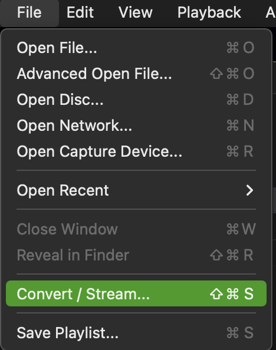
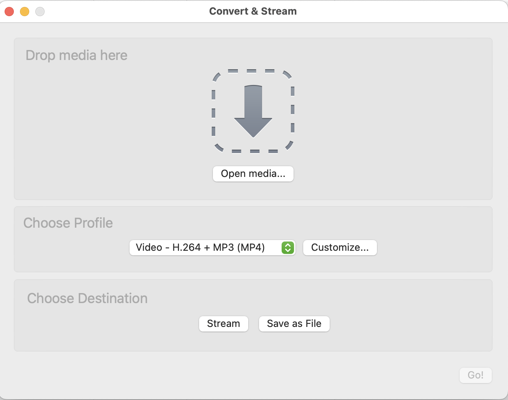
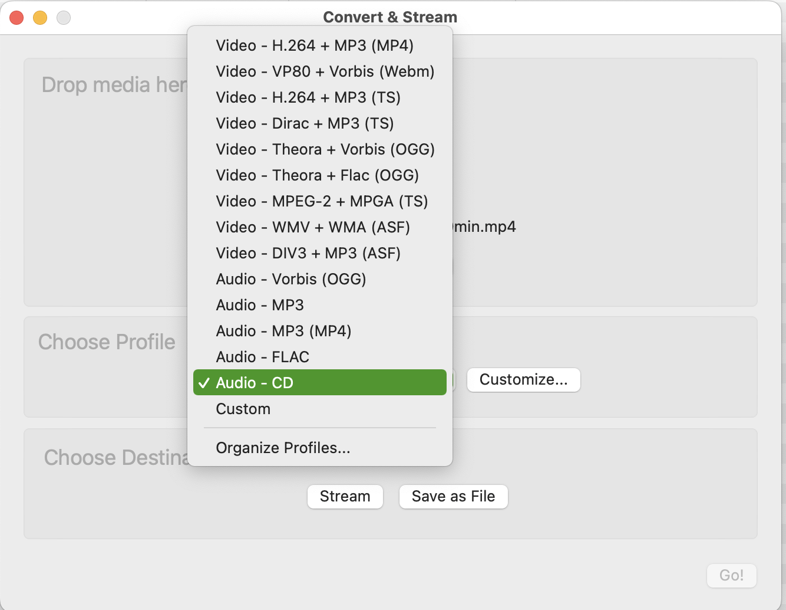
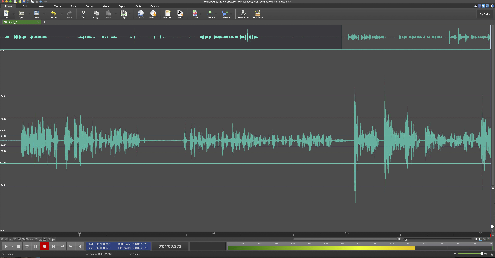
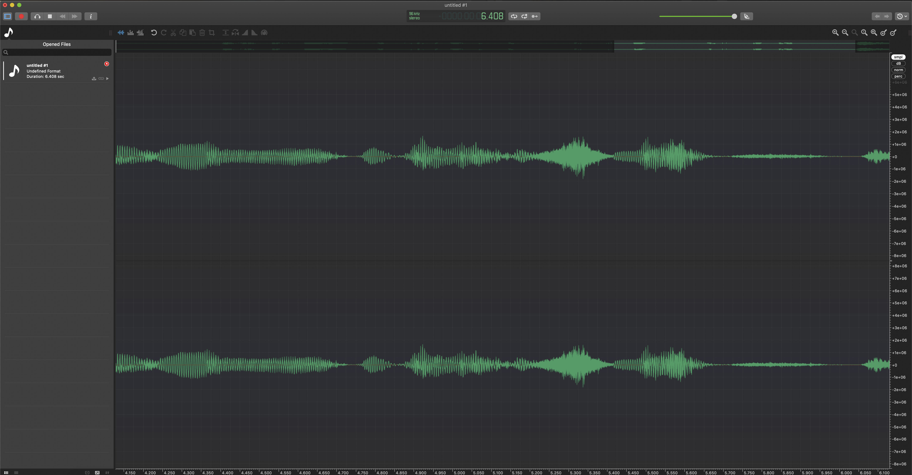

<details closed markdown="block">
  <summary>
    Table of contents
  </summary>
  {: .text-delta }
1. TOC
{:toc}
</details>

<style>
H5{color:White !important;}
</style>

<style>
H6{color:White !important;}
</style>

# Audio processing
<br>
<p align="center">
🚧 This page is currently under construction 🚧
</p>

<br>
<p align="center">
  
</p>
<br>

<span style="font-variant:small-caps;">Last updated: 19 July 2023</span>

## PARADISEC audio processing workflow for archiving
This workflow is targeted toward born-digital audio files or files that come to PARADISEC that have previously been digitised by another party.

### PARADISEC audio standards

*For further information on digital formats we accept, see [Standard formats for archiving with PARADISEC](https://paradisec-archive.github.io/PARADISEC_workflows/04_standard_formats.html#standard-formats-for-archiving-with-paradisec){:target="_blank"}.*

PARADISEC accepts audio files with the following formats: .wav, .aiff, .m4a, mp3. These files are transcoded, resampled and sent to our archive system as 96kHz, 24-bit stereo .wav files. We then create BWF archival .wav files, with an access .mp3 copy. We prefer that the audio be sent to us as close to the archival standard of 24bit, 96kHz as possible.

### Resampling audio using Audacity


### Extracting audio from a video
If you want to extract the audio track from a video file, here are two way you can do this, both using software that is available for free:

#### Extracting a .wav file from a video file using VLC Media Player
You can download VLC's free media player [here](https://www.videolan.org/vlc/){:target="_blank"}

1. Open VLC and navigate to **File** in the main menu and select **Convert/Stream...**

    <p align="center">
       
     </p>

2. Drag the video file you want to extract the audio from into the Convert & Stream window

    <p align="center">
       
     </p>

3. Under "Choose Profile" select the **Audio - CD** from the drop-down menu. You can select **Customize...** if you want to alter the default .wav settings from a sample rate of 44100, bitrate 128, 2 channels.

    <p align="center">
       
     </p>

4. Choose the destination for the output file and save it.

#### Extracting a .wav file from a video file using FFmpeg

If you want to retain the same audio quality as the source video:
```
ffmpeg -i  <name_of_input_video.extension> <name_of_output_audio.extension>
```

Simply put:
```
ffmpeg -i  video.mp4 audio.wav
```

If the original video (.avi, .mts, .mp4, .mov, etc.) has only one audio channel, or has a sampling or bit rate you want to change, take a look at the previous section on audio processing with ffmpeg.


## Low-cost Options
Post-production of digitised audio and processing of born-digital audio files can be achieved using the following free programs:

* [NCH Wavepad](https://www.nch.com.au/wavepad/index.html){:target="_blank"} (free)

    <p align="center">
       
     </p>


* [Ocenaudio](https://www.ocenaudio.com/en/startpage){:target="_blank"} (free)

    <p align="center">
       
     </p>

* [Audition](https://www.audacityteam.org/){:target="_blank"} (free)

    <p align="center">
       
     </p>

All three of these options allow you to export a stereo file at 96kHz/24bit, edit silences at the beginning or end of your audio files, boost the audio gain if the volume is too low or uneven across the two channels, or any other necessary interventions.

<br>
<hr style="border:1px solid grey">

## Additional resources

Prentice, W. and Gaustad, L. (eds.). (2017). **IASA-TC03: The Safeguarding of the Audio Heritage: Ethics, Principles and Preservation Strategy**, 4th edition (IASA Technical Publications IASA-TC03; Technical Committee Standards, Recommended Practices, and Strategies, p. 21). International Association of Sound Archives and Audiovisual Archives. [https://www.iasa-web.org/tc03/ethics-principles-preservation-strategy]( https://www.iasa-web.org/tc03/ethics-principles-preservation-strategy){:target="_blank"}.

Bradley, K. (ed.). (2009). **IASA-TC04: Guidelines on the production and preservation on digital audio objects: Standards, recommended practices and strategies**, 2nd edition (IASA Technical Publications IASA-TC04; Technical Committee Standards, Recommended Practices, and Strategies, p. 156).  International Association of Sound and Audiovisual. [https://www.iasa-web.org/tc04/audio-preservation](https://www.iasa-web.org/tc04/audio-preservation){:target="_blank"}

Schüller, D. and Häfner, A. (eds.). (2014). **IASA-TC05: Handling and Storage of Audio and Video Carriers**. First edition. [https://www.iasa-web.org/handling-storage-tc05](https://www.iasa-web.org/handling-storage-tc05){:target="_blank"}.

⬆️ [Back to top](#)

<a rel="license" href="http://creativecommons.org/licenses/by-nc-sa/4.0/"></a><br />This work was created by Julia Colleen Miller and is licensed under a <a rel="license" href="http://creativecommons.org/licenses/by-nc-sa/4.0/">Creative Commons Attribution-NonCommercial-ShareAlike 4.0 International License</a>{:target="_blank"}.