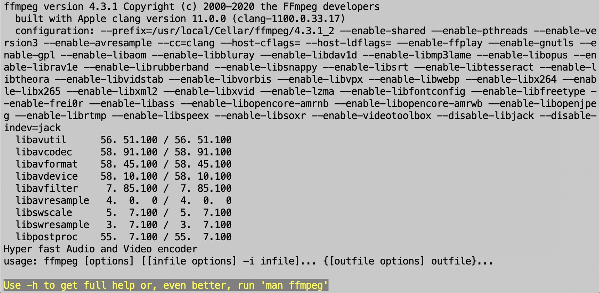

---
title: Video Processing with FFmpeg
layout: default
published: true
nav_order: 8
--- 

<details closed markdown="block">
  <summary>
    Table of contents
  </summary>
  {: .text-delta }
1. TOC
{:toc}
</details>

<style>
H5{color:White !important;}
</style>

<style>
H6{color:White !important;}
</style>

# Video Processing with FFmpeg

<p align="center">
🚧 This page is currently under construction 🚧
</p>

*This technical guide was created as part of the archiving workflow for PARADISEC. Some of the content may not be relevant for general users.* 

<span style="font-variant:small-caps;">Last updated: 02 March 2023</span>


FFmpeg is an efficient and cost effective way to process video. It is done by using a command line interface (CLI), but once the workflow is set up, it is relatively simple.


## Installation options

1\. Installation links fo Mac:
* Download source code: [FFmpeg](https://ffmpeg.org/download.html#build-mac){:target="_blank"} 
* Download using Homebrew: [Homebrew](https://formulae.brew.sh/formula/ffmpeg){:target="_blank"}

Because this can be a tricky process to install, here are some helpful sites: 
* [How to install FFmpeg](https://www.hostinger.com/tutorials/how-to-install-ffmpeg){:target="_blank"}
* [Installing ffmpeg and ffprobe on macOS manually](https://bbc.github.io/bbcat-orchestration-docs/installation-mac-manual/){:target="_blank"}

To test if you have installed FFmpeg correctly, just type ```ffmpeg``` in Terminal and hit Return. Information about the version of FFmpeg as well as enabled libraries should appear in your terminal window as seen in the image below.

<p align="center">
  
</p>
As suggested in that final line in the above image, to view the FFmpeg manual in the terminal window, type in:

    man ffmpeg

2\. Installation on Windows
* Download executable file: [FFmpeg](https://ffmpeg.org/download.html#build-windows){:target="_blank"}

Helpful sites for installation on Windows: 
* [How to install FFmpeg](https://www.hostinger.com/tutorials/how-to-install-ffmpeg){:target="_blank"}
* [How to install FFmpeg on Windows](https://www.geeksforgeeks.org/how-to-install-ffmpeg-on-windows/){:target="_blank"}


## Some helpful FFmpeg 'recipes' for using FFmpeg on a Mac

### To transcode .MOV to .MP4 (H.246)

If you have multiple .MOV files you want to transcode:

Place all .MOV files in one folder and navigate to that folder in Terminal. Then type (or copy) this code into the Terminal:


    for i in *.MOV; do ffmpeg -i “$i” -c:v libx264 -pix_fmt yuv420p -preset veryslow -crf 18 -c:a aac “$(basename “$i” .MOV)”.mp4 ; done


If you have a single file:


    ffmpeg -i FileName.MOV; -c:v libx264 -pix_fmt yuv420p -preset veryslow -crf 18 -c:a aac FileName.MP4


### To transcode problematic .MOV to .MP4 (H.264)

**SCENARIO:** Sometimes we receive older, problematic video formats. In this case we had multiple .MOV videos that would not play in QuickTime and could not be opened by Adobe Media Encoder. After a first-pass it was found that some files had audio in only one channel, sometimes left, sometimes right. Also, these were interlaced video and the target was to be progressive. 

*If audio in LEFT Channel only* (use: -af "pan=stereo|FL=FL|FR=FL"):

    for  i in *.mov; do ffmpeg -i "$i" -af "pan=stereo|FL=FL|FR=FL" -c:v libx264 -b:v 50M -vf "yadif,format=yuv420p" "$(basename "$i" .mov)".mp4  ; done

*Addressing horizontal lines due to interlaced -> progressive transcoding* (use: -vf "yadif):

    for i in *.mov; do ffmpeg -i "$i" -c:a aac -c:v libx264 -b:v 10M -vf "yadif,format=yuv420p" "$(basename "$i" .mov)".mp4  ; done


## Anatomy of the FFmpeg transcode command

    for i in *.MOV; do ffmpeg -i “$i” -c:v libx264 -pix_fmt yuv420p -preset veryslow -crf 18 -c:a aac “$(basename “$i” .MOV)”.mp4 ; done

| Command   | Result       |
| :---      | :---         |
| for i in *.MOV | points to all of the input files in that directory that are .MOV |
| do ffmpeg     |  activates ffmpeg |
| -i “$i” | specifically states that for each input file, a variable is created using $ in order to reference it, and “ ” to retain the original filename  |
| -c:v libx264      | -c:v is used to make a change to the video codec of the input file; our selected encoder is libx264. This will create an H.264/MPEG-4 AVC file, which is the standard .MP4 format for PARADISEC and generally speaking is an industry standard**       |
| -pix_fmt yuv420p     | -pix_fmt is used to make a change to the chroma and depth of the input file; our selection is yuv420p. This is the YUV planar colour space with 4:2:0 chroma subsampling. Our chosen encoder libx264 uses chroma/depth subsampling parameters that will yield the closest match to the input file (4:4:4, 4:2:2, or 4:2:0). QuickTime and other players may not be able to decode H.264 files that aren’t 4:2:0, so we overtly specify this in our command       |
| -preset veryslow     | This sets the preset speed to one of the slowest speeds to create a very high quality compression        |
| -crf 18     | The CRF (Constant Rate Factor) for transcoding H.264, 8-bit files using the libx264 encoder is on a scale of 0-51, where 0 is the best and 51 is the worst. If a CRF level isn’t specified, then the default 23 is used. 18 is considered to be virtually visually lossless        |
| -c:a aac     | -c:a aac is used to re-encode the audio using the AAC audio codec. Note: if you are creating an .MP4, you cannot use the PCM (Pulse-Code Modulation) audio codec        |
|“$(basename “$i” .MOV)”.mp4     | “$(basename “$i” .MOV)”.mp4 ensures that all input .MOV files will keep their original names, but will gain the new format extension, .mp4        |


For further help using FFmpeg, take a look at the following sites:

**FFmpeg:** [https://ffmpeg.org/ffmpeg.html](https://ffmpeg.org/ffmpeg.html){:target="_blank"}

**ffmprovisor:** [https://amiaopensource.github.io/ffmprovisr/](https://amiaopensource.github.io/ffmprovisr/){:target="_blank"}


<br>
<hr style="border:1px solid grey">

## Additional resources

 **ffmpeg** [https://ffmpeg.org/documentation.html](https://ffmpeg.org/documentation.html){:target="_blank"}
 
 **ffmprovisor** [https://amiaopensource.github.io/ffmprovisr/](https://amiaopensource.github.io/ffmprovisr/){:target="_blank"}

Blewer, A. (2020). **Pragmatic Audiovisual Preservation**, DPC Technology Watch Report, p. 45. Digital Preservation Coalition. [https://doi.org/10.7207/twr20-10](https://doi.org/10.7207/twr20-10){:target="_blank"}.

Fleischhauer, C., & Bradley, K. (2019). **IASA-TC06: Guidelines for the Preservation of Video Recordings**, v2019 (IASA Technical Publications IASA-TC06; Technical Committee Standards, Recommended Practices, and Strategies, p. 336). International Association of Sound and Audiovisual Archives. [https://www.iasa-web.org/tc06/guidelines-preservation-video-recordings](https://www.iasa-web.org/tc06/guidelines-preservation-video-recordings){:target="_blank"}.

⬆️ [Back to top](#)

<a rel="license" href="http://creativecommons.org/licenses/by-nc-sa/4.0/"></a><br />This work is licensed under a <a rel="license" href="http://creativecommons.org/licenses/by-nc-sa/4.0/">Creative Commons Attribution-NonCommercial-ShareAlike 4.0 International License</a>{:target="_blank"}.