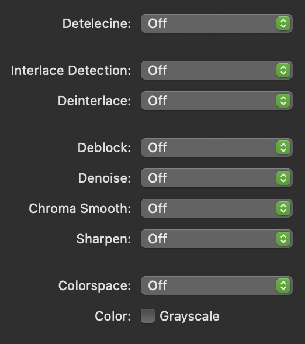
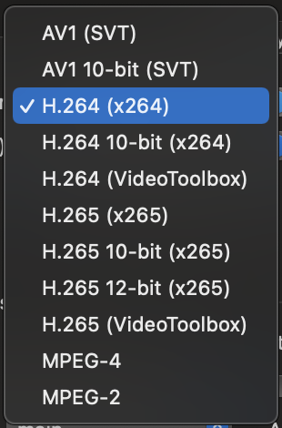
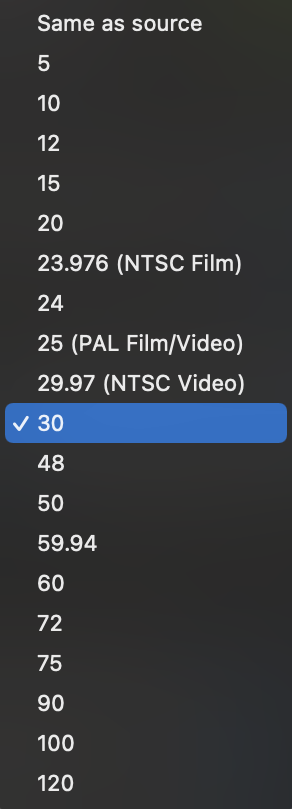
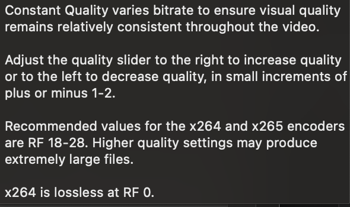
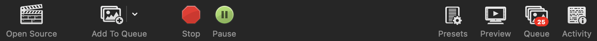
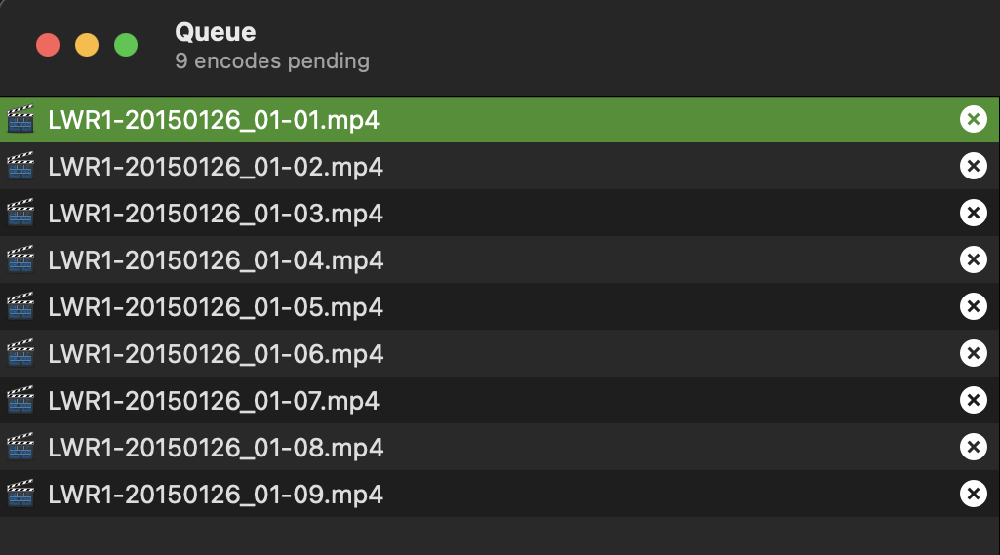
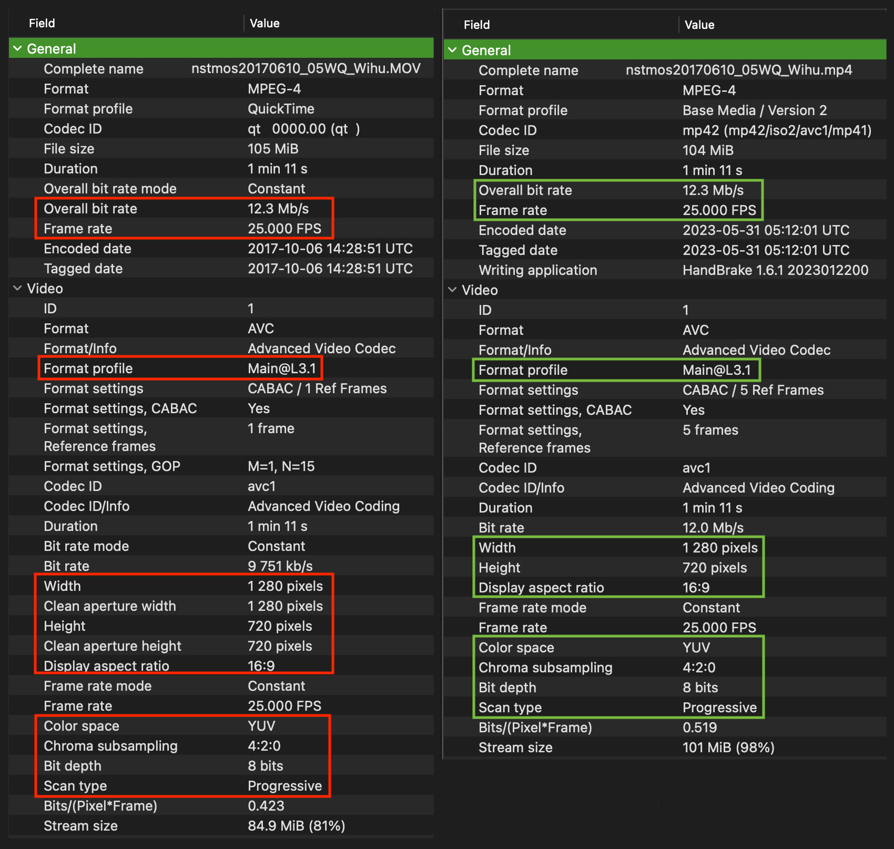

---
title: Video Processing with HandBrake
layout: default
published: true
nav_order: 8.5
--- 

  

    Table of contents
  

  {: .text-delta }
1. TOC
{:toc}

# Video Processing with HandBrake

  

🚧 This page is currently under construction 🚧

*This technical guide was created as part of the archiving workflow for PARADISEC. Some of the content may not be relevant for general users.* 

Last updated: 08 June 2023

HandBrake is a free, open source video transcoder that you can use on Mac, Windows, and Linux systems. 

## Installation options

* [Installing HandBrake's GUI](https://handbrake.fr/downloads.php){:target="_blank"} 
* [Installing HandBrakeCLI](https://handbrake.fr/downloads2.php){:target="_blank"}

Instructions for downloading and installing HandBrake can be found [here](https://handbrake.fr/docs/en/1.6.0/get-handbrake/download-and-install.html){:target="_blank"}.

## Metadata you should collect prior to transcoding: 
Before you proceed, collect the important structural metadata about your video files; this will inform your workflow and whether or not you can do batch processing. This Metadata query can be done using MediaInfo on individual files, or via a batch export outlined here: [MediaInfo metadata export](https://paradisec-archive.github.io/PARADISEC_workflows/10_quality_control.html#mediainfo){:target="_blank"}. 

* **Size/dimension** - (height and width measurements, aspect ratio)
* **Framerate (fps)**
* **Encoding format profile** - (ex: High@L4.0)
* **BitRate** - If doing batch processes with a target constant Bitrate, you will need to group your videos by Bitrate value
* **Video scan type** - Progressive or interlaced 

## The HandBrake workspace
When you open HandBrake, you are prompted to navigate to your video file. If HandBrake is already open, just drag and drop a video into the program window. You can only select or drag and drop one video at a time (jump to [batch processing](https://paradisec-archive.github.io/PARADISEC_workflows/08a_video_processing_HandBrake.html#to-transcode-multiple-videos-in-a-batch) to read about how to transcode more than one video at a time). You will then see a workspace similar to this one (*HandBrake version 1.6.1 for Mac*):

  

Below are brief descriptions about each of the tabs found in the HandBrake workspace and how to refine the transcoding settings to create your target format. 

### Summary tab

  

The **Summary** tab is the default active tab when you open a video in HandBrake. It provides an overview of selected default settings, specifically the target format (MP4, H.264), the FPS (30), audio codec (AAC), filters that are currently selected (comb detect, decomb), and the aspect ratio. 

If you are happy with the default setting and the location where the file is to be written, you can just hit the *Start* button at the top of the window. 

If you want a different format to MP4, such as MKV or WebM, you can use the dropdown menu. As for the default settings for the tick boxes, my suggestion is to leave them as they are. The same goes for the settings located right above the tabs. If you decide to create a preset to transcode a set of videos with similar encoding features, you would select it from the preset dropdown menu. 

If you have specific changes to the default encoding settings, then step through the remaining tabs and make your changes.

### Dimensions tab

  

In the **Dimensions** tab you can make changes to the aspect ratio, including adding letterbox or pillarbox. You can also crop, rotate or flip your video.

Any changes you make to these settings can be previewed in the **Summary** tab prior to transcoding.

### Filters tab

  

The **Filters** tab has the default settings as seen above. It is a good idea to determine if that setting is needed. If you have a *progressive* video, you should turn off the filters, rather than retaining the default. 

  

If you have an *interlaced* video and you wish to make it *progressive* you should apply the **Bwdif** filter as seen below.

  

 If you do not apply a filter when you transcode an interlaced video to progressive, you will create a video with combing artifacts, essentially horizontal lines that appear with rapid motion.

To read more about deinterlacing and detelecine, visit this site [https://www.dr-lex.be/info-stuff/videotips.html#deinter](https://www.dr-lex.be/info-stuff/videotips.html#deinter){:target="_blank"}.

### Video tab

  

The **Video** tab offers a number of parameters you can adjust. 

#### Video Encoding
You can select different encoders from the dropdown menu as seen below:

  

It is also with this menu you can adjust your transcoding to accommodate a 10-bit source video.

#### Frames per Second (fps)
Here you can adjust the fps if HandBrake does not correctly capture your source frame rate.

  

#### Video Quality
Video quality can be changed by adjusting one of two settings: 

1. Constant Quality: setting the slider to acheive a constant rate factor (CRF): 

  

2. Average BitRate: setting the average BitRate to match the overall BitRate of your source videos. You should select to run a 2-pass encoding here to ensure a better match to the target BitRate.

#### Video Encoding Profile

For more information on video encoding profiles, visit this site: [https://streaminglearningcenter.com/codecs/beginners-guide-to-encoding-h264.html#h-264-profiles](https://streaminglearningcenter.com/codecs/beginners-guide-to-encoding-h264.html#h-264-profiles){:target="_blank"}.

### Audio tab

  

### Subtitles tab

  

### Chapters tab

  

## Transcoding tasks
Below are possible scenarios and workflows for using HandBrake for transcoding your digital videos. You can transcode from the following formats: .MOV .AVI .MTS .M4V .MKV .WEBM .FLV .MPG .MPEG .MXF, etc

### To transcode multiple videos in a batch
To transcode multiple videos at one time, you need to add each file one at a time to the queue. Once you have opened a video file in HandBrake (and created an appropriate preset) click on the **Add to Queue** button in the upper left of the workspace. 

  

As you add files one at a time, it is a good idea to open up your queue by clicking on **Queue** in the upper right of the workspace and make sure you have added all the files you intend to transcode:

  

Once all your files are added to the queue, simply press Start.

### Transcoding workflow designed for creating .MP4 (H.264) access videos for PARADISEC

1. Collect the necessary metadata for videos. Group files that have similar BitRate, fps, Aspect Ratio, Scan type, Encoding Profile, allowing you to batch encode
2. Drag one file into HandBrake
3. Create a preset for the set of videos that match this first file (or open a saved preset that matches the file's features)
4. Click on "Add To Queue" button and repeat the process of adding to the queue for each file in the set

#### Creating a preset for PARADISEC .mp4 (H.264) access videos

*The following instructions are geared toward creating presets to transcode access videos for PARADISEC; however, this workflow will hopefully empower general users to create their own transcoded videos.*

If your source file is ***Interlaced***, you need to apply a filter to create a ***Progressive*** version. Use the Bwdif filter as mentioned [above](https://paradisec-archive.github.io/PARADISEC_workflows/08a_video_processing_HandBrake.html#filters).

Below is a MediaInfo metadtata comparison of the source .MOV file on the left (with red highlights) and the transcoded .MP4 on the right (with green highlights). The highlighted items are the key specifications to aim for in order to retain quality in the transcoded file.

  

### Things to watch out for

>
>**NOTE**: There may be a mismatch in a file's storage size and its display size as seen in the summary tab of an older .AVI video below. The file's aspect ratio shown in the top image is correctly represented by the display size (640x480) and NOT the storage size (720x480). To check if the storage aspect is indeed incorrect, I altered the video dimensions to represent the storage size. That distortion can be seen in the bottom image. I then transcoded the file using the display size.
>

  

 

## Additional resources

 Ozer, Jan. (2021, August 1). **Beginner's Guide to Encoding H.264**. *streaminglearningcenter.com*. Retrieved May 30, 2023, from [https://streaminglearningcenter.com/codecs/beginners-guide-to-encoding-h264.html](https://streaminglearningcenter.com/codecs/beginners-guide-to-encoding-h264.html){:target="_blank"}.
 
 Sepos, Bradley (2023). **HandBrake Documentation**. *handbrake.fr*. Retrieved May 30, 2023, from [https://handbrake.fr/docs/](https://handbrake.fr/docs/){:target="_blank"}.
 
 Thomas, Alexander (2023, April). **Video Encoding Tips**. *dr-lex.be*. Retrieved May 30, 2023, from [https://www.dr-lex.be/info-stuff/videotips.html](https://www.dr-lex.be/info-stuff/videotips.html){:target="_blank"}.

⬆️ [Back to top](#)

 This work was created by Julia Colleen Miller and is licensed under a <a rel="license" href="http://creativecommons.org/licenses/by-nc-sa/4.0/">Creative Commons Attribution-NonCommercial-ShareAlike 4.0 International License</a>{:target="_blank"}.