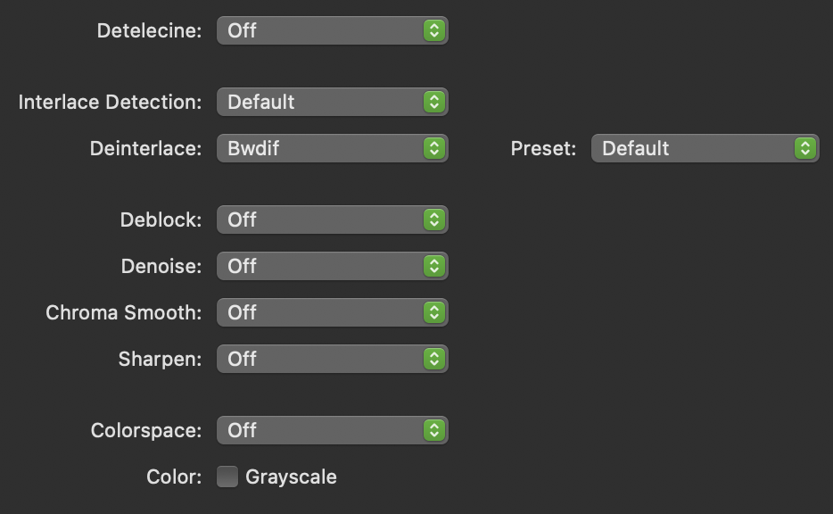

---
title: Video Processing with HandBrake
layout: default
published: true
nav_order: 8.5
--- 

  

    Table of contents
  

  {: .text-delta }
1. TOC
{:toc}

# Video Processing with HandBrake

  

🚧 This page is currently under construction 🚧

*This technical guide was created as part of the archiving workflow for PARADISEC. Some of the content may not be relevant for general users.* 

Last updated: 30 May 2023

HandBrake is a free, open source video transcoder that you can use on Mac, Windows, and Linux systems. 

## Installation options

* [Installing HandBrake's GUI](https://handbrake.fr/downloads.php){:target="_blank"} 
* [Installing HandBrakeCLI](https://handbrake.fr/downloads2.php){:target="_blank"}

Instructions for downloading and installing HandBrake can be found [here](https://handbrake.fr/docs/en/1.6.0/get-handbrake/download-and-install.html){:target="_blank"}.

## Metadata you should collect prior to transcoding: 
Before you proceed, collect the important structural metadata about your video files; this will inform your workflow and whether or not you can do batch processing. This Metadata query can be done using MediaInfo on individual files, or via a batch export outlined here: [MediaInfo metadata export](https://paradisec-archive.github.io/PARADISEC_workflows/10_quality_control.html#mediainfo){:target="_blank"}. 

* **Size/dimension** - (height and width measurements, aspect ratio)
* **Framerate (FPS)**
* **Encoding format profile** - (ex: High@L4.0)
* **BitRate** - If doing batch processes with a target constant Bitrate, you will need to group your videos by Bitrate value
* **Video scan type** - Progressive or interlaced 
* **Audio Bitrate** - You may have received a file with a very robust audio track, ex 256. HandBrake's default is 160

## The HandBrake workspace
When you open HandBrake, you are prompted to navigate to your video file. If HandBrake is already open, just drag and drop a video into the program window. You can only select or drag and drop one video at a time (jump to [batch processing](https://paradisec-archive.github.io/PARADISEC_workflows/08a_video_processing_HandBrake.html#to-transcode-multiple-videos-in-a-batch) to read about how to transcode more than one video at a time). You will then see a workspace similar to this one (*HandBrake version 1.6.1 for Mac*):

  

Below are brief descriptions about each of the tabs found in the HandBrake workspace and how to refine the transcoding settings to create your target format. This advice is geared toward processing access videos for the PARADISEC archive; however, this will hopefully empower you to create your own transcoding targets.

### Summary

  

The **Summary** tab is the default active tab when you open a video in HandBrake. It provides an overview of selected default settings, specifically the target format (MP4, H.264), the FPS (30), audio codec (AAC), filters that are currently selected (comb detect, decomb), and the aspect ratio. 

If you are happy with the default setting and the location where the file is to be written, you can just hit the *Start* button at the top of the window. 

If you want a different format to MP4, such as MKV or WebM, you can use the dropdown menu. As for the default settings for the tick boxes, my suggestion is to leave them as they are. The same goes for the settings located right above the tabs. If you decide to create a preset to transcode a set of videos with similar encoding features, you would select it from the preset dropdown menu. 

If you have specific changes to the default encoding settings, then step through the remaining tabs and make your changes.

### Dimensions

  

In the **Dimensions** tab you can make changes to the aspect ratio, including adding letterbox or pillarbox. You can also crop, rotate or flip your video.

Any changes you make to these settings can be previewed in the **Summary** tab prior to transcoding.

### Filters

  

The **Filters** tab is very important, especially if you have *interlaced* videos and you wish to make them *progressive*. If you do not apply a filter when you transcode an interlaced video, you will create a progressive video with combing artifacts, essentially horizontal lines that appear with rapid motion. In this tab you can set a filter of deactivate filtering if you do not need it.

To read more about deinterlacing and detelecine, visit this site [https://www.dr-lex.be/info-stuff/videotips.html#deinter](https://www.dr-lex.be/info-stuff/videotips.html#deinter){:target="_blank"}.

The default setting for the filters is

  

### Video

  

### Audio

  

### Subtitles

  

### Chapters

  

## Transcoding tasks
Below are possible scenarios and workflows for using HandBrake for transcoding your digital videos. You can transcode from the following formats: .MOV .AVI .MTS .M4V .MKV .WEBM .FLV .MPG .MPEG .MXF, etc

### To transcode a single video

### To transcode multiple videos in a batch

### Things to watch out for

>
>**NOTE**: As mentioned above, there may be a mismatch in a file's storage and display size as seen in the below screenshots. The file's aspect ratio (as confirmend by MediaInfo) matches the final display dimensions configured by HandBrake and the file did not look distorted, so I kept those dimensions when transcoding, and not the storage dimensions.
>

  

 

## Additional resources

 Ozer, Jan. (2021, August 1). **Beginner's Guide to Encoding H.264**. *streaminglearningcenter.com*. Retrieved May 30, 2023, from [https://streaminglearningcenter.com/codecs/beginners-guide-to-encoding-h264.html](https://streaminglearningcenter.com/codecs/beginners-guide-to-encoding-h264.html){:target="_blank"}.
 
 Sepos, Bradley (2023). **HandBrake Documentation**. *handbrake.fr*. Retrieved May 30, 2023, from [https://handbrake.fr/docs/](https://handbrake.fr/docs/){:target="_blank"}.
 
 Thomas, Alexander (2023, April). **Video Encoding Tips**. *dr-lex.be*. Retrieved May 30, 2023, from [https://www.dr-lex.be/info-stuff/videotips.html](https://www.dr-lex.be/info-stuff/videotips.html){:target="_blank"}.

⬆️ [Back to top](#)

 This work was created by Julia Colleen Miller and is licensed under a <a rel="license" href="http://creativecommons.org/licenses/by-nc-sa/4.0/">Creative Commons Attribution-NonCommercial-ShareAlike 4.0 International License</a>{:target="_blank"}.