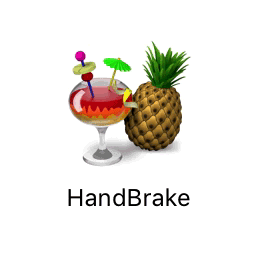

---
title: Video Processing with HandBrake
layout: default
published: true
nav_order: 8.5
--- 

  

    Table of contents
  

  {: .text-delta }
1. TOC
{:toc}

# Video Processing with HandBrake

  

🚧 This page is currently under construction 🚧

*This technical guide was created as part of the archiving workflow for PARADISEC. Some of the content may not be relevant for general users.* 

Last updated: 19 May 2023

HandBrake is a free, open source video transcoder that you can use on a Mac, Windows, and Linux. 

## Installation options

* [Installing HandBrake's GUI](https://handbrake.fr/downloads.php){:target="_blank"} 
* [Installing HandBrakeCLI](https://handbrake.fr/downloads2.php){:target="_blank"}

### To transcode .MOV to .MP4 (H.246)

### To transcode problematic .MOV to .MP4 (H.264)

 

## Additional resources

 **HandBrake Documentation** [https://handbrake.fr/docs/](https://handbrake.fr/docs/){:target="_blank"}
 
 **Helpful information on deinterlacing, YADIF, BWDIF, decomb, etc.**: [https://www.dr-lex.be/info-stuff/videotips.html#deinter](https://www.dr-lex.be/info-stuff/videotips.html#deinter/){:target="_blank"}, from: 
 Thomas. Alexander. (2023) **Video Encoding Tips** [https://www.dr-lex.be/info-stuff/videotips.html](https://www.dr-lex.be/info-stuff/videotips.html){:target="_blank"}.

⬆️ [Back to top](#)

 This work is licensed under a <a rel="license" href="http://creativecommons.org/licenses/by-nc-sa/4.0/">Creative Commons Attribution-NonCommercial-ShareAlike 4.0 International License</a>{:target="_blank"}.