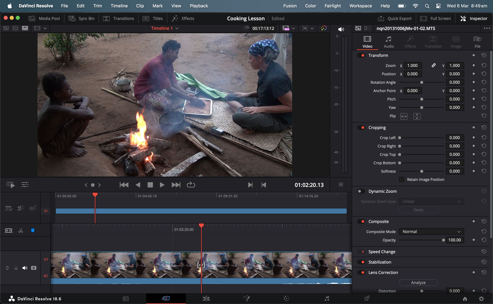
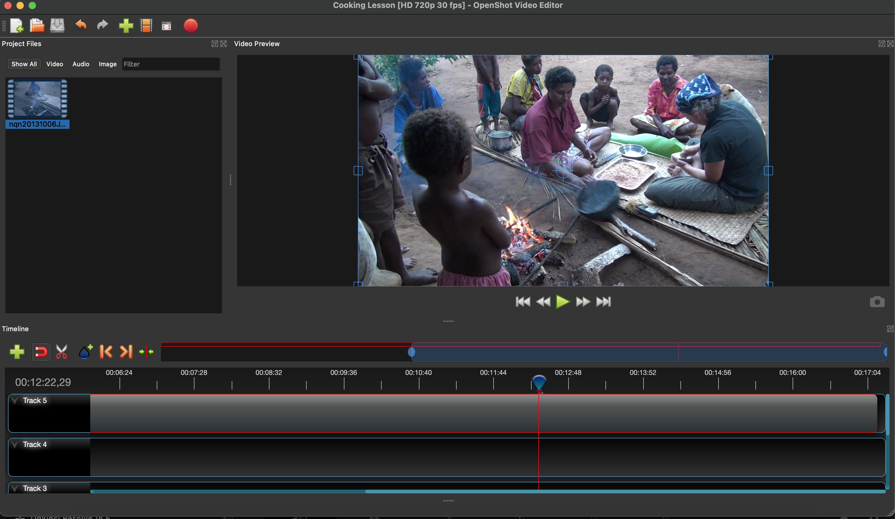

### Explanation of the Specifications used to create lossless MXF
* **JPEG 2000 MXF OP1a** is the MXF (Material Exchage Format) Operational Pattern 1a (OP1a), with lossles JPEG 2000 in a generic container *(for more information see the Federal Agencies Digital Guidelines Initiative [FADGI](http://www.digitizationguidelines.gov/guidelines/MXF_app_spec.html){:target="_blank"})* 

* **YUV** is the *Colour-difference component* suggested by IASA for born-digital .MXF. **Y** (or often **Y′**) stands for the *luma*, or *brightness*, *component*; **U** and **V** are the two *colour components*. YUV colour encoding takes into consideration human perception thus creating an output that has masked any human-noticable distortions *(for more information see [YUV](https://en.wikipedia.org/wiki/YUV){:target="_blank"})*.

* **4:2:2** is the *Chroma subsamlping* and denotes the vertical and horizontal subsampling *(for more information read Charles Poynton's work on Chroma subsampling [HERE](https://poynton.ca/PDFs/Chroma_subsampling_notation.pdf){:target="_blank"})*.

* **8-bits** per channel is typically the *bit depth* for many of the original .MOV, .MTS, .AVI, .MP4, etc. video files we handle. Using a 10-bit depth would needlessly increase the file-size while adding no improved quality. 

>
>**Note:** If you do receive a video that has a bit depth of 10, you need to create transcoded versions with the same bit depth of 10, rather than 8.
>

* **Broadcast profile** determines the maximum sampling and bit rates of the output file. **Level 7 lossless (L7)** is 520 Msamples /s and and unspecified Max Bitrate.

## Creating MP4 (H.264) videos

The **H.264/MPEG-4 AVC** is a standard format that is widely accepted (easily transcoded and decoded) and is the target streaming/access video format we archive in PARADISEC. The video format of *MPEG-4, Part 14* is the container format, *Advanced Video Coding* (AVC), also known as *H.264*, is the video compression standard. The target audio coding standard within the .MP4 is *Advanced Audio Coding (AAC)*, and ***not*** Linear Pulse Code Modulation (LPCM).

### Define Encoding Settings: Making an Encoding Preset for MP4 (H.264)

The process for creating the .MP4s is simillar to that of the .MXF as discussed above, so this section will only provide the actual settings and not the full workflow. 

## Low-cost Options for video editing and transcoding

There are a few non-linear (timeline-based) video editing tools available that are free. These tools behave a bit like [Adobe Premiere Pro](https://www.adobe.com/au/products/premiere.html){:target="_blank"} or [Final Cut Pro](https://www.apple.com/au/final-cut-pro/){:target="_blank"}. You can add media, see a timeline as well as a video player. When you move your cursor through the timeline, the video scrubs through frame-by-frame. This allows you to make targeted cuts, extract clips, add still images, add audio tracks, increase volume for all of the video, or just parts. You can also add subtitles. The videos can then be exported to a variety of formats.

[Davinci Resolve](https://www.blackmagicdesign.com/products/davinciresolve){:target="_blank"} is a professional video editing program that has a rather steep learning curve (it comes with a 4,100 page .pdf instuction manual). The free version is a full-capacity tool that offers robust options for editing, effects, colour correction, audio editing, and much more.

  

[OpenShot](https://www.openshot.org/){:target="_blank"} is a very simple video editing tool that allow you to make edits, extract clips, adjust volume, add audio tracks, etc. You can also make cuts, or add markers and export the project as an .EDL file (Edit Decision Lists) or as an .XML for use wit Final Cut Pro. If you open the .EDL with a text editor, you can retreive a list of all edits made, including the start and end times for each cut you made, names of all files in project, etc.

  

 

## Additional resources

Blewer, A. (2020). **Pragmatic Audiovisual Preservation**, DPC Technology Watch Report, p. 45. Digital Preservation Coalition. [https://doi.org/10.7207/twr20-10](https://doi.org/10.7207/twr20-10){:target="_blank"}.

Fleischhauer, C., & Bradley, K. (2019). **IASA-TC06: Guidelines for the Preservation of Video Recordings**, v2019 (IASA Technical Publications IASA-TC06; Technical Committee Standards, Recommended Practices, and Strategies, p. 336). International Association of Sound and Audiovisual Archives. [https://www.iasa-web.org/tc06/guidelines-preservation-video-recordings](https://www.iasa-web.org/tc06/guidelines-preservation-video-recordings){:target="_blank"}.

⬆️ [Back to top](#)

 This work was created by Julia Colleen Miller and is licensed under a <a rel="license" href="http://creativecommons.org/licenses/by-nc-sa/4.0/">Creative Commons Attribution-NonCommercial-ShareAlike 4.0 International License</a>{:target="_blank"}.