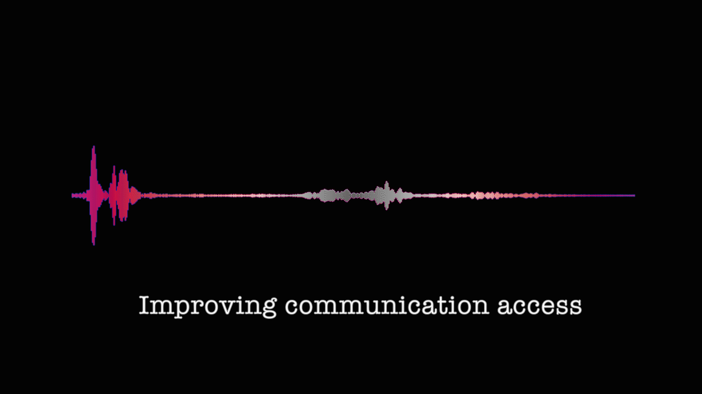

---
title: Improving Communication Access
layout: default
published: true
nav_order: 10
--- 

<details closed markdown="block">
  <summary>
    Table of contents
  </summary>
  {: .text-delta }
1. TOC
{:toc}
</details>

<style>
H5{color:White !important;}
</style>

<style>
H6{color:White !important;}
</style>


## Improving communication access for deaf and hard of hearing people 
<br>

Developed by [Julia Miller](mailto:julia.miller@anu.edu.au){:target="_blank"} & [Gabrielle Hodge](mailto:g.hodge@ucl.ac.uk){:target="_blank"}<br>
*With thanks to Ida Rogers, Joshua Sealy and the CoEDL Executive Committee*

<p align="center">
  
</p>

<span style="font-variant:small-caps;">Last updated: 28 June 2021</span>

*This working guide was motivated by feedback provided to CoEDL’s Education Committee about the possibility of improving the accessibility of our educational and other public-facing output for deaf and hard of hearing colleagues, and many other people who benefit from captioned content or sign language interpreting services. It is not an exhaustive description of options available, rather it offers some simple workflows for anyone who wants to create captioned content for recordings after-the-fact or to learn more about providing captions or sign language interpreting for in-person or virtual events. We welcome any feedback, questions or suggestions as we move to improve communication access at CoEDL. Please get in touch via the email addresses above.*
<br>
<hr style="border:1px solid grey">
<br>
Deaf and hard of hearing people have historically been marginalised in academia, and deaf signing people even more so. It is very difficult to request, organise and facilitate effective communication access if you need to use captions and/or a sign language. There are many factors that make this situation difficult. As an example, imagine you are a deaf signing academic, other professional or community member wanting to attend a seminar on a topic relevant to your research and/or community. You must first email the seminar organiser and ask about what (if any) communication access will be provided, and/or set the process in motion for organising your own access. 

Responses can vary, but it is common to receive a response such as, *“Sorry, we don’t have the funds, there’s no budget line for this,”* and no further engagement. A particularly negative and resistant response can involve upwards of twenty emails as the deaf person seeks to explain and justify why they belong at this seminar, and how they can participate. Or it can involve no response at all. Even a positive response will often come with lots of invisible labour in teaching organisers how to work with sign language interpreters, and dealing with various hiccups that come with learning any new process. From the perspective of a deaf person, it won’t be the first nor the last time this happens. These responses are experienced over and over again in different spaces and with different people. Sometimes access is provided, but only after a long and unnecessary battle. Unfortunately, many people experience burn-out and give up along the way. As solutions can often eventually be found, this suggests the main barrier relates to attitudes more so than budgets.

Some of these responses may feel reasonable from an institutional and bureaucratic perspective, but it does not feel reasonable from a personal and individual one. The prevailing ideology is that communication access is too expensive, which means that deafness and deaf or hard of hearing people are treated as financially unsustainable. This is exhausting and harmful to both the deaf person and the academy as a whole. Over time, the cumulative effect is that deaf people and sign languages are not welcome in academic spaces. If the deaf academic or deaf participant is Aboriginal or Torres Strait Islander or from any other underrepresented group who has not historically participated in academia, these issues will be compounded by other barriers resulting from structural racism and other forms of systemic oppression. The result will be that deaf and hard of hearing signing people do not participate and everyone misses out. 

As academics committed to equitable and democratic scholarship, we need to consider the impact that various institutional practices and norms can have on different people who want to participate. Many barriers can be removed by understanding what different forms of discrimination look like and how they can be avoided. This working guide is not exhaustive, as it focuses only on communication access for deaf and hard of hearing people. It is important to recognise that facilitating communication access is not just a response to one individual at one meeting or event. In time, many people will benefit as barriers are removed and the space becomes more equitable.
<br>
<hr style="border:1px solid grey">

### Captioning options to improve accessibility of your audio-visual content

<br>
#### Some terms used
* **Closed captioning vs open captioning**: Closed captions are ones that you can choose to display or not display. YouTube videos will often have CC options, as does Netflix. Open captions are those that cannot be removed from the display. An example is if you have created a subtitled video and burned the text into the video footage(this process will be described below).
* **Automatic captioning**: Auto-captioning uses AI (artificial intelligence) to process the speech to text. YouTube uses this technology (this will be discussed below), as do apps that you can use on your computer or smartphone.
* **Captions vs transcriptions**: Captions are typically presented at the bottom of the video, transcriptions can be provided in a separate file as text, of it can be displayed in a side panel, but not in the video, itself.


#### What type of access could be offered and when?
1. **Captioning pre-recorded content:**
* When lectures, meetings, seminars, or workshopsare recorded live and with no deaf people or others needing captions presentin the audience, these presentations can becaptioned after the event and made available to the public.
* Pre-recorded videos presented at a conference can be captioned prior to sending to conference organisers. Making a captioned version available would greatly improve access to your content.
2. **Live captioning and/or interpreting:** When deaf or hard of hearing colleagues want to access and participate in live lectures, meetings, seminars, or workshops, you should make sure they have access to one or both of the following *(these services may be provided by the participant’s home institution, but this should not be assumed, as affiliation does not guarantee access)*:
* **Live captions or transcriptions (onsite or remote):** Captions or transcriptions created by a human which can be done onsite or remotely. One method is referred to as *STTR (Speech-to-Text Relay)* in Australia and the UK. Another method is *CART (Communication Access Real-Time Translation)* in the USA. Both terms refer to the same output. The methods used to achieve either may be different, e.g., stenograph versus respeaking, which can affect the quality of captions produced. The output may be presented as captions or a transcription projected onto a screen, and/or sent directly to the laptop of the participant. However, it is important to realise that deaf and hard of hearing participants are often excluded from participating in discussions or question/answer sessions when using captions. This is because there is a delay between what is spoken and what is captioned, and/or when there is no option for deaf and hard of hearing participants to respond via typing text, and/or when they prefer to sign rather than type text. Moderators need to be aware there will be a delay, and check if anyone relying on captions needs clarification or wants to contribute.
* **Sign language interpreters:** Qualified sign language interpreters can be booked to provide access for signing deaf people who use interpreters. A major benefit is that interpreters facilitate two-way interaction in real time, enabling everyone to access each other. Captions will only work one-way between people with sensorial asymmetries, e.g., between people who do not sign and deaf people who do not speak. Sign language interpreting is a very personal process and quality can vary widely. It is a good idea to liaise directly with the deaf person to find outwhat language, service and interpreters they prefer to use, [see below](#providing-interpreters-who-can-work-between-signed-and-spoken-languages) for more information on booking and working with sign language interpreters.


#### How to caption pre-recorded content
##### Creating captions using YouTube

<br>
Below is a video that instructs you in creating captions for media using YouTube's AI (Artificial Intelligence) process *as a starting point*. 

<hr style="border:1px solid blue">
**Note:**
More information, including a .pdf version of the step-by-step process, can be found here: [Creating Captions Guidelines](https://www.dynamicsoflanguage.edu.au/news-and-media/latest-headlines/article/?id=new-guidelines-for-improving-communication-access){:target="_blank"}
<hr style="border:1px solid blue">
The steps outlined in the video:

   * Upload video to your YouTube page (you need to have a YouTube account)
   * YouTube will create captions automatically, usually within a few hours 
   * Using YouTube Studio from your account page, you will edit any mistakes made by YouTube's AI process
   * Check the appropriateness of the caption alignment and amount of words on the screen, making sure the captions easy to read
   * Introduce each new speaker in the captions, e.g. ```[SPEAKER: Dr. Smith] Thank you for inviting me today.```
   * Download your newly corrected captions as .srt file
   * Combine captions with your video using the free software [Handbrake](https://handbrake.fr/){:target="_blank"}
<br>
<p align="center">
<iframe id="video" width="560" height="315" src="https://www.youtube.com/embed/MQMdm6BYAJo" frameborder="0" allow="autoplay; encrypted-media" allowfullscreen=""></iframe>
</p>

<hr style="border:1px solid grey">

##### Options for live captioning of online event

###### Captions by AI -Artificial Intelligence

* **Zoom** does have the option for the host of a meeting to engage the live captioning AI tool; **however**, this is dependent upon your institution’s license with Zoom. *At this time, ANU is in negotiations with Zoom to secure a new license, which would include this feature. Check with your versions of Zoom and if it is not a feature you can use, contact your institution’s IT department (those responsible for Zoom) or your Accessibility Services team and lodge a request. This is no guarantee you will get this feature-but providing feedback to your institution will be helpful.*

*For more information on how this works:* [https://support.zoom.us/hc/en-us/articles/207279736-Closed-captioning-and-live-transcription](https://support.zoom.us/hc/en-us/articles/207279736-Closed-captioning-and-live-transcription){:target="_blank"}


* **Zoom + Otter.ai** is another method of live transcribing during a meeting, using artificial intelligence. Zoom allows for 3rd party software to perform auto-generated transcripts; this occurs in a separate text box, not as captions within the video window. If your institution does not provide this software to staff, there is a subscription for use. Otter’s Business Plan includes live captions for Zoom.

*See University of Melbourne’s findings on accuracy of Otter.ai’s auto-transcripts:* [https://www.unimelb.edu.au/accessibility/tutorials/zoom/zoom-meetings-and-automatically-generated-transcripts](https://www.unimelb.edu.au/accessibility/tutorials/zoom/zoom-meetings-and-automatically-generated-transcriptsg){:target="_blank"}


* **Microsoft Teams** also has a live captioning feature for meetings held within the MS Teams App.

*See University of Melbourne’s findings on accuracy of MS Teams auto-captioning:* [https://www.unimelb.edu.au/accessibility/video-conferencing-for-hearing-impaired-staff/auto-captioning](https://www.unimelb.edu.au/accessibility/video-conferencing-for-hearing-impaired-staff/auto-captioning){:target="_blank"}
<br>

<br>
<hr style="border:1px solid blue">
> **NOTE: Things to keep in mind with AI auto-captioning**
> 1. For it to be useful, you should have a good microphone, the speaker needs clear pronunciation, the participants need to observe good sequential turn taking, and there should be limited background noise
> 2. AI captioned output will have many mistakes, perhaps even so many that > the content is no longer accurate or useful
> 3. AI software may have subscriptions that are not covered by your institution
<hr style="border:1px solid blue">
<br>

###### Live human captioning during online meeting

* **CART** *(Communication Access Real-Time Translation)*** or **STTR** *(Speech-to-Text Relay)* is a service where a trained stenographer is either on-site or at a remote location listening to the speech and types the captions in real time. This is the method used to create transcripts of live court proceedings. However, some CART or STTR services (often for remote captions) are provided via re-speaking technologies, where a person listens to the speech and respeaks it more clearly for the AI recognition technology, which creates the captions. Stenography is a far more accurate method for live captioning.
* Zoom has a feature which allows someone designated by the host to type in what is being said, and this can be seen as closed captions to anyone in the meeting who wishes to view it.

<br>
<hr style="border:1px solid blue">
> **NOTE: Things to keep in mind with live-captioning**
> 1. CART or STTR option will have increased the quality of your transcriptions, but it will be costly, as you are paying for a trained service provider to type in captions during your event
> 2. CART or STTR can be provided by an on-site captioner or remotely. Remote caption services are often cheaper. However, you need to weigh up the benefits for the people requiring access for the meeting
> 3. It is a good idea to talk with the people requiring access to work out the best solution for the specific context
> 4. Deaf and hard of hearing participants are often excluded from participating in discussions or question/answer sessions when using captions. This is because there is a delay between what is spoken and what is captioned, and/or when there is no option for deaf and hard of hearing participants to respond via typing text, and/or when they prefer to sign rather than type text. Remember there will be a delay and check if anyone relying on captions needs clarification or wants to contribute
<hr style="border:1px solid blue">
<br>

### Providing interpreters who can work between signed and spoken languages

There are many different situations in which you may need to book sign language interpreters. You may have invited a deaf academic from Australia or overseas. You may have received a request from a deaf member of the public to attend a seminar or event. You may be hosting an event on a topic related to deafness, deaf people and sign language and seek to make it accessible for the wider deaf community. Different situations may require different processes for booking sign language interpreters.

#### Sign language interpreters

Qualified sign language interpreters work to simultaneously interpret between a spoken language (e.g., English) and a signed language (e.g., Auslan). They are language professionals akin to spoken language interpreters who work between two spoken languages. They have undertaken extensive training in language and interpreting. Some have also undertaken training in translation, although translation is historically the domain of deaf interpretersand translators.

However, there is a key difference: interpreting between two spoken languages is usually done consecutively, whereas interpreting between a spoken and signed language is done simultaneously. It is important to recognise this because the demands of the interaction will be different and there is a higher chance for miscommunications that remain invisible to non-signers. 

As explained above, interpreters can be booked to provide access for signing deaf people who work with sign language interpreters to access spoken language events and enable non-signing speakers to access them in return. This is the major benefit of working with sign language interpreters ahead of captions: they facilitate two-way interaction in real time, enabling everyone to access each other. Unless the event moderator is very careful to ensure two-way participation [see above](#what-type-of-access-could-be-offered-and-when), captions will often only work one-way between people with sensorial asymmetries, e.g., between people who do not know the sign language and deaf people who do not have speech privilege, and only as long as both share the same written language of the captions.


*Sign language interpreting is a very personal process and quality can vary widely. Interpreters may or may not be active members of the community to which the deaf participants belong. Here are some general guidelines:*

* It is a good idea and collegial to liaise directly with the deaf participants to find out what service and interpreters they prefer to use. Sometimes they may prefer to organise and book their own interpreters, but this cannot be assumed. It may not be an option for the person.
* It requires working far in advance than you may be used to, up to one month in advance, preferably earlier for large events and/or niche topics including academic presentations, which is a very specialised interpreting domain. Leaving it two weeks before the event will probably mean there are no interpreters available. Interpreters for academic situations often require preparation materials minimum two weeks in advance of the event to do their job effectively [see below](#there-are-four-steps-and-responsibilities-involved-in-finding-booking-and-working-with-interpreters).
* Depending on the situation, some deaf participants may be able to cover the cost of interpreting with their own funds. However, this cannot be assumed as it varies so widely according to country and individual. If the person has recourse to funds, they will usually tell you upfront. If there is no recourse to funds, you will need to arrange a budget. This may be via the central University body, Department or some other means. If you are organising a conference and there is no budget for communication access, you need to consider why this is the case.
* It is important to work with interpreters who are registered with NAATI or equivalent professional bodies of the country of origin. Please check that the interpreters you are booking are registered professionals.
* Sign language interpreters typically work in pairs. In Australia, the minimum cost will be for two interpreters for a two-hour assignment, although you can of course book two interpreters for shorter or longer durations. The interpreting team will switch roles every 15-20 minutes to assist with the cognitive labour of simultaneous interpreting. Some interpreters will accept bookings to work solo for up to one hour, as long as breaks are included and carefully monitored. However, this is usually negotiated on a case-by-case basis and only for small, one-to-one meetings, for example. It is not usually possible for dense academic presentations.
* Consider how different contexts (e.g.,in-person versus virtual) can enhance or oppress communication between non-signing and signing people (who must visually attend to the interpreter while they are signing, and therefore cannot look at other things at the same time). The Deafness Cognition and Language (DCAL) research centre at UCL has published these helpful guidelines on managing online events that involve deaf signing people, sign language interpreters and/or captions: [https://www.ucl.ac.uk/dcal/remote-working-guidelines](https://www.ucl.ac.uk/dcal/remote-working-guidelines){:target="_blank"}

<hr style="border:1px solid grey">

#### Steps & responsibilities involved in finding, booking & working with interpreters

1. *Determining what communication access is required* <br>
This includes finding out what language services are needed, e.g., Auslan/English interpreters, ASL/English interpreters, or some other language pair. Even if you are not organising and paying for the interpreting specifically, as the organiser of the event you will need to facilitate how communication access is provided, and this includes working with the interpreters to ensure the event runs effectively. Some large events, e.g., international conferences, may have different interpreting teams and language pairs. Often these events will require a designated Interpreter Coordinator to liaise between all and ensure cohesive service delivery.

2. *Choosing and confirming interpreters* <br>
This involves reaching out to different agencies or individual interpreters (if indicated as preferred or recommended by a deaf participant) to confirm the nature of the assignment, e.g.,whether it is a seminar or other event, and the topic of the assignment, as well as logistics such as the date and time. It is worthwhile establishing relationships with reputable interpreting agencies and interpreting professionals who can support this. Interpreters specialise in different areas, including academia. **It is very important that you seek and receive confirmation of the booking.** Do not assume that because you have put in a request that the assignment will be confirmed. Interpreters are in very high demand and sometimes it is not possible to book for those specific dates and times. You need to know this information as soon as possible in order to widen your search.

3. *Sending preparation to interpreters* <br>
This involves sharing any preparation materials with the confirmed interpreting team that can assist them in their work, e.g., draft slides, lecture notes, dot points, a publication, etc. This material enables interpreters to learn and orient effectively to the language and concepts you will be talking about. *Typically, interpreters require this preparation material a minimum of two weeks before the event.* They need time to read and digest it. They are working all day every day on other assignments like you, hence the need for preparation to be sent two weeks in advance. Of course, if it is a last-minute booking this will not be possible, but this is a general guide that will facilitate good relationships and communication access. Working with interpreters is also about building professional relationships, and indeed this is often how it works between individual deaf signing people and interpreters.

4. *Receiving invoices and paying interpreters* <br>
If you are covering the cost of interpreters and managing the finances of the event, you will receive an invoice from each interpreter after the event. You will need to pay this within the specified period. Late payments can damage professional relationships with interpreters.

<hr style="border:1px solid grey">

### Services and Tools
* Expression Australia (Auslan interpreting, captioning, notetaking,transcription): [https://www.expression.com.au/services/interpreting-and-captioning](https://www.expression.com.au/services/interpreting-and-captioning){:target="_blank"}
* The Deaf Society (Auslan interpreting): [https://deafsociety.org.au/](https://deafsociety.org.au/){:target="_blank"}
* Ai-Media(Live CART captioning org): [https://www.ai-media.tv/](https://www.ai-media.tv/){:target="_blank"}
* Otter.ai (AI captioning tool): [https://otter.ai/](https://otter.ai/){:target="_blank"}


### Other Helpful Links
* DCAL Remote Working guidelines for working with sign language interpreters on Zoom, etc: [https://www.ucl.ac.uk/dcal/remote-working-guidelines](https://www.ucl.ac.uk/dcal/remote-working-guidelines){:target="_blank"}
* Automatic closed captioning with Zoom in use at the University College London: [https://www.ucl.ac.uk/teaching-learning/news/2021/mar/zoom-licence-renewed-automatic-closed-captions-and-transcriptions-added](https://www.ucl.ac.uk/teaching-learning/news/2021/mar/zoom-licence-renewed-automatic-closed-captions-and-transcriptions-added){:target="_blank"}
* University of Melbourne articles on Auto-Captioning:
    * [https://www.unimelb.edu.au/accessibility/video-conferencing-for-hearing-impaired-staff/auto-captioning](https://www.unimelb.edu.au/accessibility/video-conferencing-for-hearing-impaired-staff/auto-captioning){:target="_blank"}
    * [https://www.unimelb.edu.au/accessibility/tutorials/zoom/zoom-meetings-and-closed-captions](https://www.unimelb.edu.au/accessibility/tutorials/zoom/zoom-meetings-and-closed-captions){:target="_blank"}
* Ai-Media Blog offers many informative posts including closed captioning how-to, tips for being Deaf-aware, what is Audism: [https://www.ai-media.tv/ai-media-blog/](https://www.ai-media.tv/ai-media-blog/){:target="_blank"}
* Great example of commitment to accessibility at Griffith University: [https://www.griffith.edu.au/accessibility/creating-accessible-learning-environments/auslan-interpreters-and-captioning-for-events](https://www.griffith.edu.au/accessibility/creating-accessible-learning-environments/auslan-interpreters-and-captioning-for-events){:target="_blank"}
* Another example of how to create accessible events from University College London: [https://www.ucl.ac.uk/equality-diversity-inclusion/equality-areas/disability-equality/tips-checklist-making-events-accessible](https://www.ucl.ac.uk/equality-diversity-inclusion/equality-areas/disability-equality/tips-checklist-making-events-accessible){:target="_blank"}


[Back to top](#)