---
title: Quality control of audio and video files
layout: default
published: true
nav_order: 10
--- 

<details closed markdown="block">
  <summary>
    Table of contents
  </summary>
  {: .text-delta }
1. TOC
{:toc}
</details>

<style>
H5{color:White !important;}
</style>

<style>
H6{color:White !important;}
</style>

# Quality control: checking the quality of audio and video files

<p align="center">
🚧 This page is currently under construction 🚧
</p>

<p align="center">
  
</p>

<span style="font-variant:small-caps;">Last updated: 01 March 2024</span>

## MediaArea tools for QC (quality checking/quality control)

Open source tools available from [MediaArea](https://mediaarea.net/){:target="_blank"}

### MediaInfo

[MediaInfo](https://mediaarea.net/en/MediaInfo){:target="_blank"} is a tool which allows you to look at a summary of the structural metadata of media files. To see a list of all metadata fields and their descriptions, click [here](https://mediaarea.net/en/MediaInfo/Support/Fields){:target="_blank"}.Below is a comparison of how MediaInfo presents the metadata information on a PC and on a Mac, both using **Tree** view.

<p align="center">
  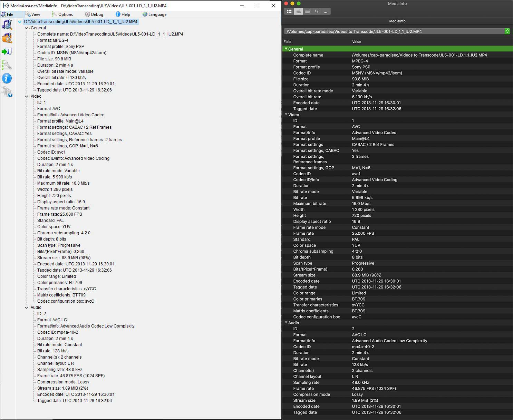
</p>

You can open multiple files at one time using the app, but be warned- if you are using MediaInfo on a PC, each metadata report will open a separate window unless you first switch your view mode to *sheet* (see next). On a Mac, only one window opens, but you can select which file to view from a dropdown menu in the file address bar at the top. The next section explains another option to view multiple file reports without having to look at one report at a time.
<br>
<br>

#### Bulk output MediaInfo reoprts: Windows

***How to bulk extract metadata to a .csv file using a PC.***

Using MediaInfo GUI v21.09, open the program, then add media to explore. To do this press icon *Select a folder to examine*, located on left pannel of window, or go to the MediaInfo menu and select *File>Open>Folder...*. It is best if you have only the media you want to examine in that folder and avoid adding nested folders. The image below shows all of the videos I have added. To get this view, go to the menu and select View, then select *sheet*.

<p align="center">
  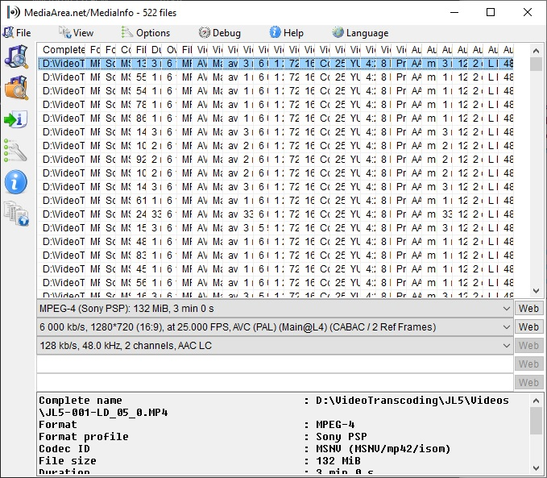
</p>

To select what specifications you want to export to a csv, go to Options>Preferences, or just click on the wrench icon to the left. The preference window will open. Under *Customize* select *Sheet* and then *New...*. 

<p align="center">
  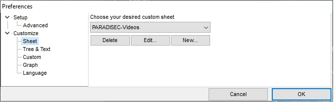
</p>

You will then be able to make your choices for the attributes you wish to export. You may need to experiment with this. I have selected the following 29 attributes to include in my report. You'll notice the three categories of metadata: General, Video, Audio. These correlate to the sections of metadata found in the MediaInfo reports as seen in the comparison image above. 

<p align="center">
  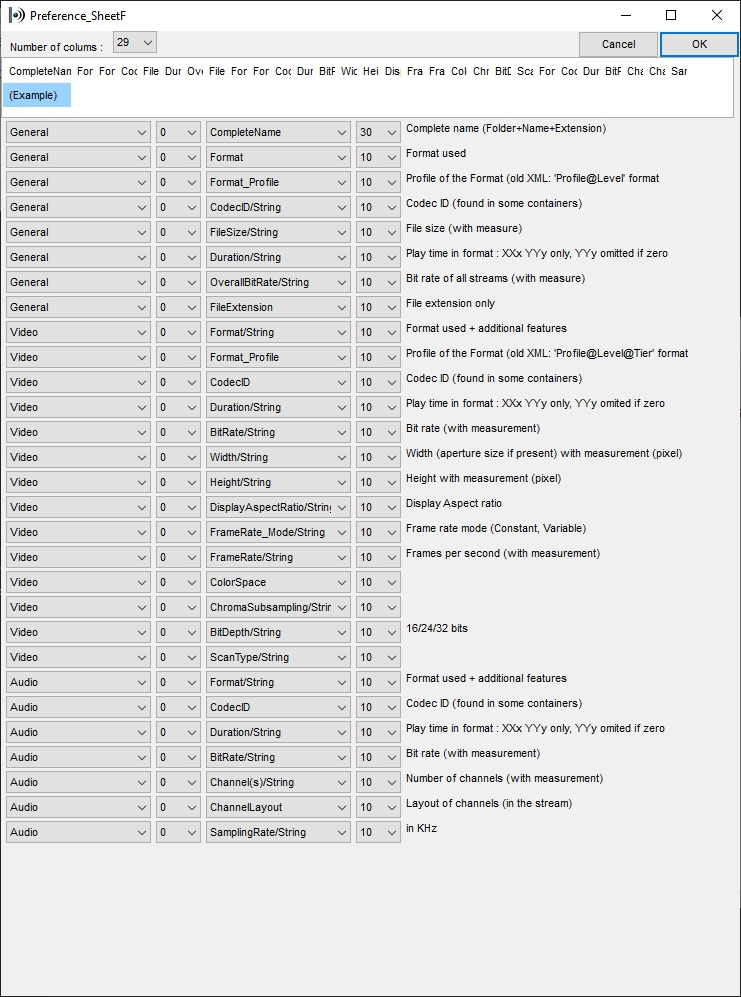
</p>

Once you have edited your target specifications to be output in your report, a new .csv is created with this information and is saved here: C:\Users\\"YourUserName"\AppData\Roaming\MediaInfo\Plugin\Sheet. If you want to share this customisation with your team, you need only send them the .csv and have them place it in the correct folder, so that they do not have to recreate the process. This is what the content of that .csv plugin looks like:

<p align="center">
  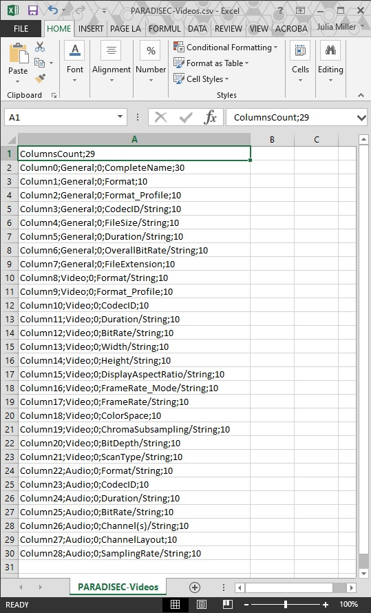
</p>

When you have saved your Custom Sheet choices, you are ready to export. First, go to *Preferences* again to select your custom sheet from the dropdown menu:

<p align="center">
  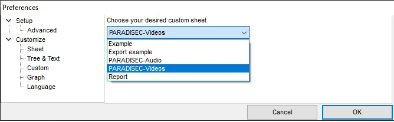
</p>

The icon to the left with the arrow and the "i" is the export function. Alternatively, you can go to *File>Export* in the menu. This window will open, directing you to choose your export format.

<p align="center">
  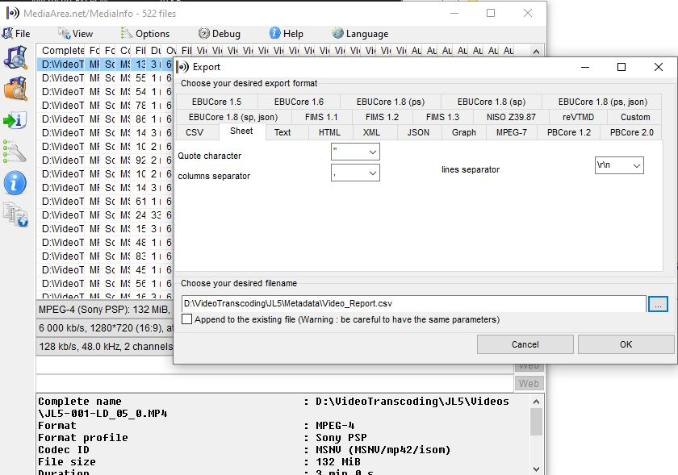
</p>

Click on the *Sheet* tab, select the comma from the dropdown menu for the columns separator, then name your output file and select the location where you want to save it.
<br>
<br>

#### Bulk output MediaInfo reports: Mac

***How to bulk extract metadata to a .csv file using a Mac.***

I have downloaded and installed the app from the Mac App Store, as suggested on the MediaInfo webpage. The Mac MediaInfo app differs from the Windows version in that you cannot view sheets, or export bulk reports using the GUI.

You first need to create a .txt file that lists the specifications you want to export, and name this file *"Options.txt"*. Again, as with the Windows specifications, you will need to experiment with how they are named. Here is some suggested content for *Options.txt* for video reporting:

```
General;%FileName%,%Format%,%Format_Profile%,%CodecID%,%FileSize%,%Duration%,%OverallBitRate%,%FileExtension%,
Video;%Format%,%CodecID%,%Width%,%Height%,%DisplayAspectRatio%,%FrameRate%,%ColorSpace%,%ChromaSubsampling%,%BitDepth%,%ScanType%,%Compression_Mode%,
Audio;%Channel(s)%,%ChannelLayout%,%SamplingRate%,
File_End;\r\n

```
Place the *Options.txt* in the same folder as the videos you wish to examine.

Open Terminal and navigate to the directory where your videos and the *Options.txt* is located.

Then type the following into the terminal:

    MediaInfo --Output=file://options.txt /Volumes/"YourDirectory" \*.\* > output.csv

Unfortunately, this will output a .csv without headers for the columns. My fix for this: I have a separate .csv saved with just the headers to paste in each newly exported report.
<br>
<br>
If you are not able to install MediaInfo onto your computer, there is a web version of MediaInfo where you can create and download reports of your video files via the web browser. Your media stays safe, as nothing is actually uploaded to their servers. [MediaInfoOnline](https://mediaarea.net/MediaInfoOnline){:target="_blank"}
<br>

### Media Conch

[Media Conch](https://mediaarea.net/MediaConch){:target="_blank"} is a tool which enables you to view batch MediaInfo reports. You can create *policies* that checks your media against certain parameters, determining if the metadata fits your specific needs. Below public policy that checks if an .mp4 video has H.264 encoding or not. You can find this public policy on the *Public Policy* tab within the app.

<p align="center">
  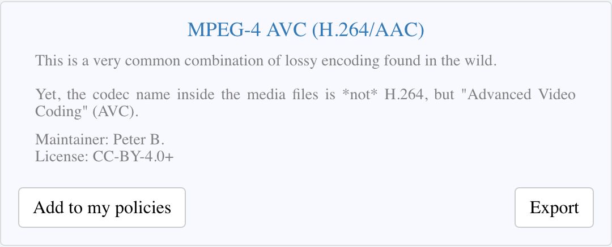
</p>

This is the description of the checks this policy is performing: 

<p align="center">
  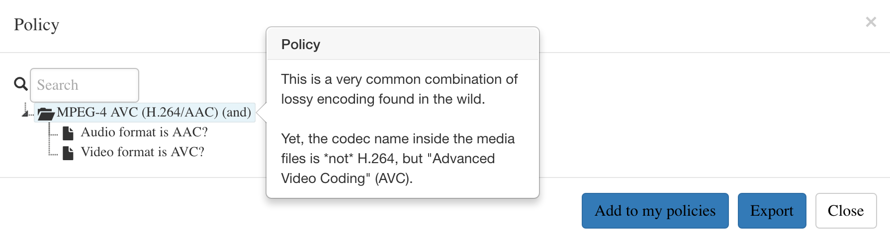
</p>

Here is a policy I created for PARADISEC, to determine if the MXF has conformed to all of our target parameters. This checks if the MXF is lossless and has the expected colour space and chroma subsampling of YUV 4:2:2, and has a bit depth of 8, etc. Policy checking can be done across multiple files at once. 

<p align="center">
  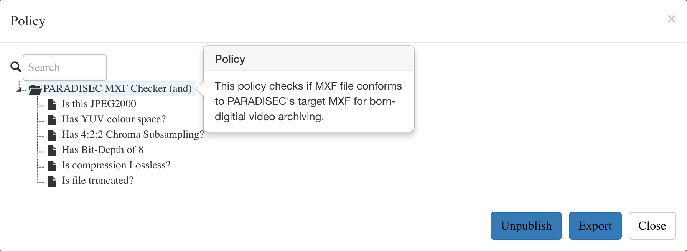
</p>

Here are the results from the MXF policy check.

<p align="center">
  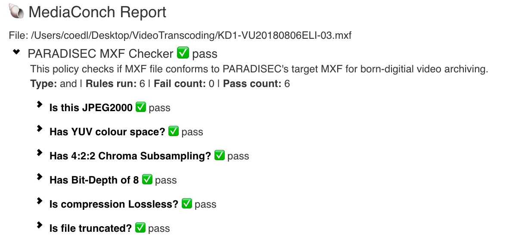
</p>

Media Conch also allows you to view MediaInfo reports within the program as well as the more technical [Media Trace](https://mediaarea.net/MediaTrace){:target="_blank"} reports, which present the binary architecture of the files as defined by MediaInfo.

<p align="center">
  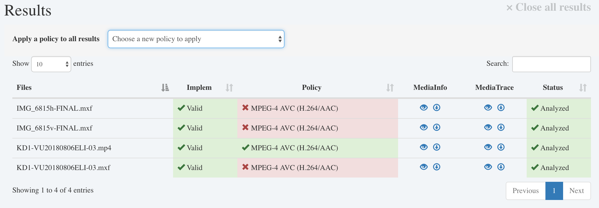
</p>
<br>
<br>

### QC Tools

[QC Tools](https://mediaarea.net/QCTools){:target="_blank"} offers tools that allow users to investigate the quality of digitised videos using filters and analytical tools. You can select various filters in the **graph mode** as seen in the image below. 

<p align="center">
  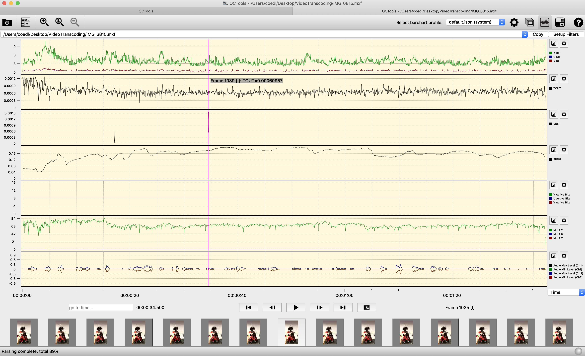
</p>


as well as in the **player mode**

<p align="center">
  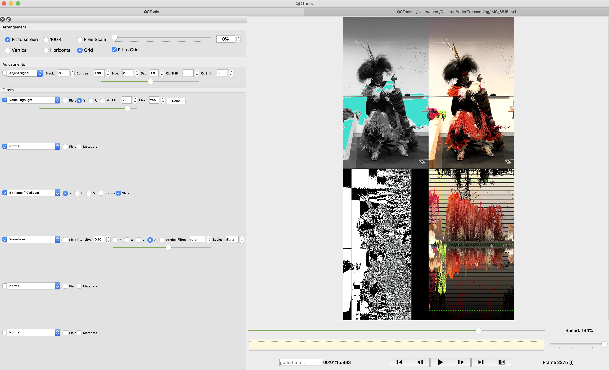
</p>

Visit this [QCTools page](https://mediaarea.net/QCTools/Playback_Filters){:target="_blank"} for descriptions of their playback filters.


### BWF MetaEdit

[BWF MetaEdit](https://mediaarea.net/BWFMetaEdit){:target="_blank"} - allows up to view and edit BEXT chunks in BWF audio files

## Using Switch player for visual QC

## Other tools

<br>
<hr style="border:1px solid grey">

## Additional resources

⬆️ [Back to top](#)

<a rel="license" href="http://creativecommons.org/licenses/by-nc-sa/4.0/"></a><br />This work was created by Julia Colleen Miller and is licensed under a <a rel="license" href="http://creativecommons.org/licenses/by-nc-sa/4.0/">Creative Commons Attribution-NonCommercial-ShareAlike 4.0 International License</a>{:target="_blank"}.