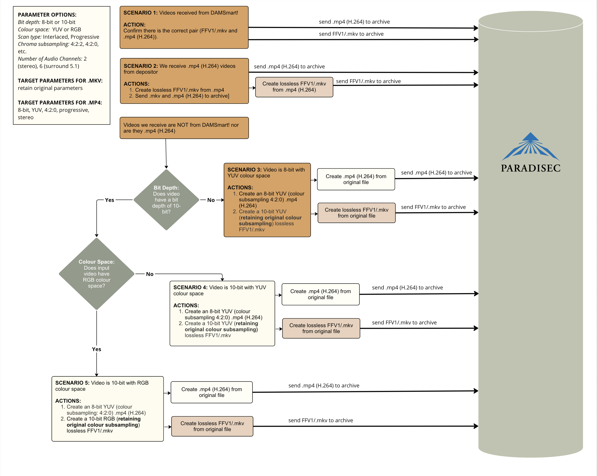

  

    Table of contents
  

  {: .text-delta }
1. TOC
{:toc}

# PARAGEST: Workflows for File Procesing and File Transfer to the PARADISEC Archive

  
  

Last updated: 13 September 2024

This workflow is designed for use by PARADISEC. For questions or comments on this document please contact us at [admin@paradisec.org.au](mailto:admin@paradisec.org.au){:target="_blank"}, or write to us at:  
**PARADISEC  
Sydney Conservatorium of Music, C41  
University of Sydney, 2006  
Ph: +61 2 9351 1279, Fax: +61 2 9351 1287**

## Video Transcoding Workflow (preliminary)

  
  

*Photo: Preliminary flowchart for digital video files, directing them to correct processing pipelines*

## Full PARAGEST Workflow

  
  

*Photo: Flowchart for all digital files to go into the PARADISEC archive*

⬆️ [Back to top](#)

 This work was created by Julia Colleen Miller and is licensed under a <a rel="license" href="http://creativecommons.org/licenses/by-nc-sa/4.0/">Creative Commons Attribution-NonCommercial-ShareAlike 4.0 International License</a>{:target="_blank"}.