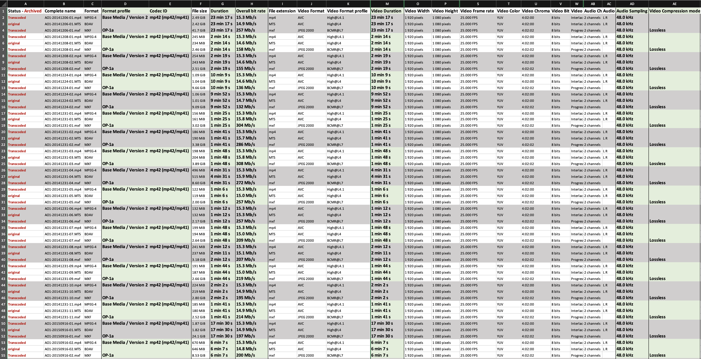

  

    Table of contents
  

  {: .text-delta }
1. TOC
{:toc}

# PARADISEC Workflow - The Australian National University
 

🚧 This page is currently under construction🚧

  
  

Last updated: 20 July 2023

This workflow is designed for use by PARADISEC staff at ANU. Some instructions may not apply to your unit. For questions or comments on this document please contact us at [admin@paradisec.org.au](mailto:admin@paradisec.org.au){:target="_blank"}, or write to us at:  
**PARADISEC  
Sydney Conservatorium of Music, C41  
University of Sydney, 2006  
Ph: +61 2 9351 1279, Fax: +61 2 9351 1287**

## Audio workflow

### Workflow for handling analogue open reel or cassette tapes
1. Create inventory of items received
2. Photograph each item, including all tape box inserts, tape labels, written inserts, etc.
3. Follow the digitising instructions outlined [here](https://paradisec-archive.github.io/PARADISEC_workflows/06_audio_digitising.html){:target="_blank"}

### Workflow for handling born-digital audio files
1. Create inventory of files received.
2. 

Reel-to-reel

Repair or replace lead tape and damaged splices if necessary
Clean using slow spool and specialist equipment (cotton pads and isopropyl/cetramide solution); also clean flange (spool) separately
Perform a second slow spool to repack tape
Cassette and DAT

Replace splices if necessary (cassette)
Fast forward and rewind to minimise print-through (cassette) and to repack tape (cassette and DAT)
If mouldy, bag up separately, to avoid cross-contamination, shelve in PARADISEC’s Dirty Room and minimise time in Ingestion Room, replay on designated dirty cassette machine

## Video workflow

### Workflow for handling video tape formats, film, or other non-file-based video formats
1. Create an inventory of items received
2. Photograph each item, including all tape box inserts, tape labels, written inserts, etc. and add PARADISEC ID slips
3. Confirm with PARADISEC admin that there is funding for out-sourcing the digitising task (though this really should be done prior to taking possession of physical items)
4. Contact DAMSmart and arrange to get the items to them; provide them with a digital version of the item inventory and how files are to be named

### Workflow for handling born-digital video files
1. Create inventory of files received
	 * It is best to use MediaInfo batch export to collect necessary structural metadata such as overall/max Bitrate (needed for transcoding), duration (needed for QC), etc. (For more information about extracting metadata with MediaInfo, click [here](https://paradisec-archive.github.io/PARADISEC_workflows/10_quality_control.html#mediainfo){:target="_blank"}).
	 * If not possible to use MediaInfo batch export, then use MediaInfo app and manually collect necessary metadata.
	 * Minimally, create a list or csv of files (Terminal print dir using "ls" is fastest).

  
  

2. Organise files by Bitrate 
3. Use Handbrake, FFmpeg, or MediaEncoder to create .mp4 (H.264), if original files are not already compliant. Follow instructions for Handbrake [here](https://paradisec-archive.github.io/PARADISEC_workflows/08a_video_processing_HandBrake.html){:target="_blank"}, FFmpeg [here](https://paradisec-archive.github.io/PARADISEC_workflows/08_video_processing_FFmpeg.html){:target="_blank"}, or MediaEncoder [here](https://paradisec-archive.github.io/PARADISEC_workflows/09_video_processing_AdobeME.html){:target="_blank"}.
4. 

⬆️ [Back to top](#)

 This work was created by Julia Colleen Miller and is licensed under a <a rel="license" href="http://creativecommons.org/licenses/by-nc-sa/4.0/">Creative Commons Attribution-NonCommercial-ShareAlike 4.0 International License</a>{:target="_blank"}.